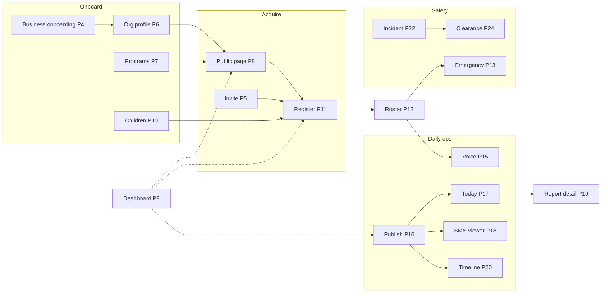
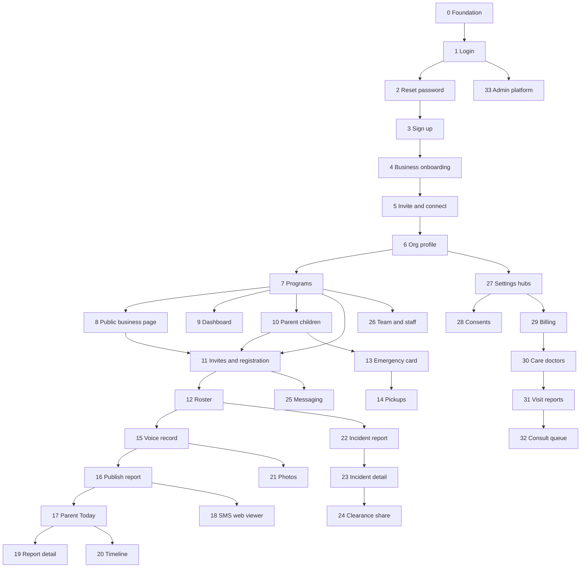

# ANCHOR_CARE — Production Development Plan

**Version:** 3.1  
**Updated:** August 5, 2026  
**Owner:** Engineering / Product  
**Status:** Active

**Related:** [DEVELOPMENT_SPEC.md](./DEVELOPMENT_SPEC.md) (flows per page ID) · [USER_JOURNEYS.md](./USER_JOURNEYS.md) · [STACK.md](./STACK.md)

---

## How this plan works

**One phase = one page (or one user-facing surface), built across every role that uses it, in dependency order.**

| Concept | Meaning |
|---------|---------|
| **Phase** | Single page/surface shipped to production-ready quality |
| **Roles column** | Which roles get a real implementation this phase (— = not applicable) |
| **Depends on** | Prior phases that must be ✅ before starting |
| **Spec** | Page IDs in [DEVELOPMENT_SPEC.md](./DEVELOPMENT_SPEC.md) |
| **DB slice** | Tables/API added **only** for this page (incremental migrations) |

**Orchestrator gate (every phase):** Security · Performance · UX/UI · QA · EN+FR i18n · `npm run build`

**After every completed phase:** append an **Implementation log** subsection under that phase, mark the phase **`✅ Complete`** in the heading and index table, and see `.cursor/rules/development-plan-phase-log.mdc`.

**Coach note:** Coach reuses Business pages with RBAC ([DEVELOPMENT_SPEC.md](./DEVELOPMENT_SPEC.md) Part B2). Same phase, stricter permissions.

---

## Current state (August 5, 2026)

| Status | Items |
|--------|--------|
| ✅ Shell + partial | Marketing, auth actions, invite table, role layouts/nav, placeholders |
| ❌ Not production | Domain tables, APIs, real page logic, Stripe, Twilio, jobs worker |
| ⚠️ Doc drift | App IA: Parent **Family + You** tabs; Business **Families + Team + Insights** — update DEVELOPMENT_SPEC as each phase ships |

**Phase tracking:** Mark `[ ]` → `[x]` in the index below when exit criteria pass.

---

## Universal page blueprint (every phase)

Every phase below uses this structure. **Do not ship a page without every subsection addressed.**

| Subsection | What to define |
|------------|----------------|
| **Value & edge** | Why this page wins vs Brightwheel / TeamSnap / WhatsApp |
| **Sections & layout** | Above-fold, scroll regions, sticky elements, responsive breakpoints |
| **Fields & forms** | Every input, validation, default, help text |
| **Modals & drawers** | Confirmations, multi-step, destructive actions |
| **Innovation** | Smart features unique to ANCHOR (not generic SaaS) |
| **DB & indexes** | Tables, columns, FKs, RLS policies, indexes |
| **API & jobs** | Route handlers, server actions, background jobs, webhooks |
| **Security** | RBAC, RLS, rate limits, CSRF, PHI rules |
| **Performance** | Pagination, caching, bundle, LCP/INP targets |
| **Scalability** | Multi-tenant, concurrency, idempotency |
| **Connections** | Links in/out — seamless handoffs to other phases |
| **UI / UX / Motion** | Premium 2026 patterns; motion with `prefers-reduced-motion` |

### Global design system (all pages)

| Token | Value | Use |
|-------|-------|-----|
| Primary | `#1B2B4B` navy | Headers, nav, trust |
| Accent | `#4ECDC4` seafoam | CTAs, success, links |
| Surface | `#F5F0E8` sand | Backgrounds, cards |
| Alert | `#E85D4C` coral | Incidents only — never decorative |
| Display | Serif (parent-facing headlines) | Today, public page, timeline |
| Body | Sans 16px+ | Forms, coach field UI |

**Motion principles**
1. **Purposeful only** — transitions explain state change (open drawer, publish success), never decoration loops
2. **Durations** — micro 120ms (hover), standard 220ms (modal), emphasis 380ms (page enter)
3. **Easing** — `cubic-bezier(0.22, 1, 0.36, 1)` enter; `cubic-bezier(0.4, 0, 1, 1)` exit
4. **Reduced motion** — instant swap or opacity-only when `prefers-reduced-motion: reduce`
5. **Haptics** — `navigator.vibrate(10)` on coach publish success (mobile, optional)
6. **Skeleton** — shimmer 1.2s linear; never spinners on full-page loads
7. **Success** — subtle scale 0.98→1 on saved toast; checkmark draw 300ms

**UX principles (affluent audience)**
1. One primary action per screen; secondary actions ghost/outline
2. Progressive disclosure — advanced fields behind "More options"
3. Empty states teach the next step with single CTA
4. Errors inline + recoverable; never dead-end without back path
5. Coach flows ≤ 3 taps to critical safety info (emergency card)
6. Parent flows work thumb-zone on 375px width
7. Business dashboard answers "Are parents engaged?" in 5 seconds

### Cross-page connection map (MVP)



**Handoff rules (implement in every phase)**
| From | To | Trigger | Preserve |
|------|-----|---------|----------|
| Public page P8 | Book & pay P11 | Tap Book & pay | `program_id`, `source=public`, return URL, **checkout session** |
| Invite P5 | Register P11 | Accept token | `invite_id`, pre-selected program |
| Register P11 | Roster P12 | Approved | Child visible to coaches |
| Publish P16 | Today P17 | Push/SMS | `child_id`, `report_id` deep link |
| Publish P16 | SMS P18 | SMS link | Signed token, no PHI in SMS body |
| Incident P22 | Clearance P24 | Parent action | `incident_id` context |
| Today P17 | Report P19 | Tap card | Scroll position restore on back |
| Any auth | Role home | Login P1 | `returnTo` query param |

---

## Phase dependency map (MVP)



---

## Phase index — MVP (Phases 0–33)

| Phase | Page / surface | Roles | Spec | Route(s) | Depends |
|-------|----------------|-------|------|----------|---------|
| **0** ✅ | Foundation | All | — | — | — |
| **1** ✅ | Login | Parent, Business, Coach, Admin | P-01, B-01, C-01, A-01 | `/login`, `/admin/login` | 0 |
| **2** | Forgot / reset password | All | P-02 | `/forgot-password`, `/reset-password` | 1 |
| **3** | Sign up (choose role) | Parent, Business | P-03, B-01 | `/sign-up`, `/sign-up/*` | 2 |
| **4** ✅ | Business onboarding wizard | Business | B-02 | `/business/onboarding` | 3 |
| **5** ✅ | Invite accept + connect program | Parent, Coach | P-04, P-04, C-01, B-06 | `/invite/[token]`, `/connect` | 3 |
| **6** ✅ | Organization profile (+ public page fields) | Business | B-17 | `/business/settings/profile` | 4 |
| **7** ✅ | Programs (pricing + Stripe Connect + public listing) | Business, Coach (read) | B-25, C-01 | `/business/programs`, `/coach/programs` | 6 |
| **8** ✅ | **Public business landing page (book & pay)** | Public, Business (preview/share) | PUB-01, PUB-02 | `/p/[slug]`, `/p/[slug]/programs/[programSlug]` | 6, 7 |
| **9** ✅ | Director dashboard + insights | Business | B-03†, dashboard | `/business/dashboard`, `/business/insights` | 7 |
| **10** ✅ | Children profiles | Parent | P-18 | `/parent/family/children` | 5 |
| **11** ✅ | Family invites + registration/waiver + **Stripe book & pay** | Business, Parent | B-06, P-21, P-22, PUB-02 | `/business/settings/invites`, `/business/families/*`, `/parent/programs/enrolled` | 7, 8, 10 |
| **12** ✅ | Roster + child detail (staff) | Business, Coach | B-03, B-04, C-03 | `/business/families/*`, `/coach/roster` | 11 |
| **13** ✅ | Emergency card | Parent, Coach, Business | P-19, B-05 | `/parent/family/emergency`, roster drill-down | 10, 12 |
| **14** ✅ | Authorized pickups | Parent | P-20 | `/parent/family/pickups` | 13 |
| **15** ✅ | Voice record | Coach, Business | B-08, C-03 | `/coach/report/[programId]/voice` | 12 |
| **16** ✅ | Review AI drafts + publish | Coach, Business | B-09, C-03 | `/coach/report/[programId]/review` | 15 |
| **17** ✅ | Parent Today | Parent | P-06, P-07 | `/parent/today` | 16 |
| **18** ✅ | SMS web report viewer | Public, Parent | P-05 | `/r/[token]` | 16 |
| **19** ✅ | Daily report detail | Parent | P-08 | `/parent/today/*`, `/parent/timeline/*` | 17 |
| **20** ✅ | Timeline | Parent | P-09 | `/parent/timeline` | 16, 19 |
| **21** ✅ | Photo upload + tag | Coach | B-10, C-03 | `/coach/report` (media step) | 16 |
| **22** ✅ | Report incident (form) | Coach, Business | B-12, C-03 | `/coach/incidents/new`, `/business/reports` | 12 |
| **23** ✅ | Incident detail + amend | Parent, Business, Coach | B-11, B-13‡, P-10 | `/business/reports/[id]`, `/parent/incidents/[id]` | 22 |
| **24** | Clearance share ✅ | Parent, Business | P-16 | Care + program notification | 23 |
| **25** | Messaging + broadcast ✅ | Parent, Business, Coach | P-23, B-14, B-15 | `/parent/messages`, business threads | 11 |
| **26** | Team + coach staff ✅ | Business | B-19 | `/business/team`, `/business/settings/staff` | 7 |
| **27** | Settings hubs ✅ | Business, Parent | B-16, P-17→You hub | `/business/settings`, `/parent/you` | 6 |
| **28** | Consents + notifications ✅ | Parent | P-28 | `/parent/you/consents` | 27 |
| **29** | Subscriptions + billing ✅ | Parent, Business | P-27, B-20 | `/parent/you/subscription`, `/business/settings/billing` | 27 |
| **30** | Doctor directory ✅ | Parent, Admin | P-11, P-12, A-03, A-04 | `/parent/care/doctors`, `/admin/doctors` | 29 |
| **31** | Visit reports vault ✅ | Parent, Admin | P-13, P-14, A-05 | `/parent/care/visits`, `/admin/visits/upload` | 30 |
| **32** | Incident consult + queue ✅ | Parent, Admin | P-15, A-06, A-07 | `/parent/care/consults`, `/admin/consults` | 23, 31 |
| **33** | Admin platform (dashboard, users, analytics) ✅ | Admin | A-02, A-08, A-09, A-10 | `/admin/*` | 1 |

† B-03 adoption metrics split: Phase 9 = KPIs; Phase 12 = full roster.  
‡ B-13 insurance PDF full export = Phase 38 (P1.5) ✅; Phase 23 = detail + amend only.

---

## Phase index — P1.5 (Phases 34–42)

| Phase | Page / surface | Roles | Spec | Route(s) | Depends |
|-------|----------------|-------|------|----------|---------|
| **34** | Running late pickup ✅ | Parent, Business | P-29 | Today banner, roster banner | 17, 12 |
| **35** | Forms vault ✅ | Parent | P-25 | `/parent/you/forms`, `/parent/family/forms` | 27 |
| **36** | Co-parent invite ✅ | Parent | P-26 | `/parent/family/coparent` | 10 |
| **37** ✅ | Field / substitute mode | Coach, Business | B-03b | `/coach/roster/field` | 12 |
| **38** ✅ | Insurance incident PDF | Business | B-13 | Export from incident detail | 23 |
| **39** ✅ | Weekly digest emails | Parent, Business, Coach | B-23, digests | Settings + cron jobs | 9, 17 |
| **40** ✅ | Shift handoff notes | Business | B-22 | `/business/roster/handoff` | 12 |
| **41** ✅ | Morning health tap | Parent, Coach | P-24 | Today + roster | 17 |
| **42** ✅ | Quiet hours (full) | Parent | P-28 | `/parent/you/consents` | 28 |

---

## Phase index — P2 (Phases 43–51)

| Phase | Page / surface | Roles | Spec | Depends |
|-------|----------------|-------|------|---------|
| **43** ✅ | In-app program discovery (city index) | Parent | P-03 discover, enrolled | 11 |
| **44** ✅ | Registration pay enhancements (promos, refunds, installments) | Parent, Business | P-22 pay+ | 11, 29 |
| **45** ✅ | Marketplace shop | Business, Parent | B shop, P marketplace | `/business/shop`, `/parent/you/marketplace` | 29 |
| **46** ✅ | Business revenue snapshot | Business | Insights extension | `/business/insights` | 9, 11 |
| **47** ✅ | Season rollover | Business | B-24 | Programs settings | 7 |
| **48** ✅ | SMS reply to report | Parent | P-30 | Twilio inbound | 18, 25 |
| **49** ✅ | Compliance bulk export | Business | B-21 | `/business/settings/compliance` | 23 |
| **50** ✅ | Referral program | Parent, Business | PRD §8.14 | Settings | 29 |
| **51** | Brightwheel / TeamSnap import | Business | PRD §8.27 | Onboarding/settings | 7 |
| **52** | Public page analytics | Business | PUB-01 analytics | Dashboard + profile | 8 |

---

## Phase index — Launch (Phase 53)

| Phase | Surface | Scope |
|-------|---------|--------|
| **53** | Production hardening | Security audit, load test, observability, legal sign-off, pilot onboarding |

---

# Phase detail specs

Each phase uses the **Universal page blueprint**. Flow details: [DEVELOPMENT_SPEC.md](./DEVELOPMENT_SPEC.md).

---

## Phase 0 — Foundation ✅ Complete

**Depends on:** — · **Roles:** All (infrastructure) · **Connects to:** every phase

### Value & edge
Shared infrastructure so every page ships with the same premium quality, security baseline, and observability — competitors bolt these on later.

### Sections & layout
N/A (no user page). Deliver shared layout shells: `AppShell`, `PageHeader`, `EmptyState`, `ErrorState`, `SkeletonList`.

### Fields & forms
Shared form primitives: `TextField`, `Select`, `DatePicker`, `PhoneInput`, `FileUpload` (crop), `RichText` (markdown subset), `SignaturePad` (waivers Phase 11).

### Modals & drawers
`ConfirmDialog`, `Sheet` (mobile filters), `Toast` stack (max 3 visible).

### Innovation
- **Design token CSS variables** — one source for public page + app consistency
- **Job runner skeleton** — `background_jobs` with retry 5/15/60 min from day one
- **Entitlements service stub** — gates timeline/care before Stripe Phase 29

### DB & indexes
Apply migrations: `profiles`, `background_jobs`, `invites`. Stub tables documented in Phase 4+ migrations file comments.

### API & jobs
`/api/health` · cron worker entry `processBackgroundJobs()` · structured logging (pino) with request ID

### Security
Middleware RBAC · CSRF on mutating routes · CSP headers · no secrets client-side · RLS enabled on all new tables

### Performance
Shared `@/` imports tree-shaken · font subset loading · image remote patterns in `next.config`

### Scalability
Multi-tenant `org_id` on all domain tables (starting Phase 4) · job queue mutex via `FOR UPDATE SKIP LOCKED`

### UI / UX / Motion
Framer Motion installed but **only** for modal/sheet; page transitions via CSS. Dark mode tokens ready.

### Exit criteria
- [x] Devs sign in against real Supabase
- [x] Advisors: no Critical on existing tables
- [x] Shared components Storybook or `/dev/ui` gallery `[optional]`

### Implementation log (completed Aug 5, 2026)

| Area | Delivered |
|------|-----------|
| **Infrastructure** | Next.js App Router, Supabase SSR, middleware RBAC, shared `AppShell` / `PageHeader` / `EmptyState` / form primitives |
| **DB** | `profiles`, `background_jobs`, `invites` base tables; RLS enabled project-wide |
| **API** | `/api/health`, cron job entry `processBackgroundJobs()` |
| **Security** | CSP headers, CSRF on mutating routes, no client secrets |
| **Key files** | `src/lib/supabase/*`, `src/components/shared/*`, `next.config.ts` |

---

## Phase 1 — Login ✅ Complete

**Spec:** P-01 · B-01 · C-01 · A-01 · **Routes:** `/login` · `/admin/login` · **Depends on:** 0  
**Connects to:** P2 reset · P3 sign-up · role homes (P9/P17/P coach/P33)

| Role | Route after login |
|------|-------------------|
| Parent | `/parent/today` |
| Business | `/business/dashboard` or `/business/onboarding` if incomplete |
| Coach | `/coach/programs` |
| Admin | `/admin/dashboard` |

### Value & edge
Single auth with **smart role routing** + `returnTo` preservation — parent from public page never loses register intent.

### Sections & layout
1. Logo + one-line value prop (role-aware copy variant)
2. OAuth row (Google, Apple) — above email form
3. Email + password + show/hide toggle
4. Forgot password link · Sign up link (role picker)
5. Footer: Terms · Privacy · language toggle EN/FR

### Fields & forms
| Field | Validation | Notes |
|-------|------------|-------|
| email | email format, max 254 | autocomplete `username` |
| password | min 8, no max leak | autocomplete `current-password` |
| remember_device | boolean | extends refresh cookie 30d |

### Modals & drawers
- Unverified email modal → resend verification
- Account suspended modal → support mailto
- OAuth merge prompt if email exists

### Innovation
- **Intent-aware redirect:** parse `returnTo` for public register, invite token, SMS report
- **Role detection:** after OAuth, if single role skip picker
- **Failed attempt backoff:** 5 fails → 60s cooldown (rate limit)

### DB & indexes
`profiles`: `role`, `onboarding_status`, `email_verified_at`, `last_login_at` · index `(email)` via auth

### API & jobs
`POST /api/auth/login` · Supabase `signInWithPassword` · audit log `login_success` / `login_fail`

### Security
Rate limit 10/min/IP · no user enumeration (same error invalid email/password) · admin login separate route + IP allowlist `[staging]`

### Performance
Login page static shell · client form only · LCP &lt; 1.5s

### Scalability
Stateless auth · Supabase handles session scale

### UI / UX / Motion
Form shake 120ms on error · success redirect fade 200ms · focus trap in modals · WCAG labels on all inputs

### Exit criteria
- [x] Each role lands on correct home with `returnTo` honored
- [x] Invalid credentials + unverified email handled
- [x] E2E: login per role + returnTo from `/p/[slug]` register

### Implementation log (completed Aug 5, 2026)

| Area | Delivered |
|------|-----------|
| **Routes** | `/login`, `/admin/login` with role-aware redirect and `returnTo` preservation |
| **API** | `POST /api/auth/login`, Supabase `signInWithPassword`, resend verification |
| **Auth flows** | Parent → `/parent/today`; Business → dashboard or onboarding; Coach → programs; Admin → admin dashboard |
| **Security** | Rate limiting, no user enumeration, unverified/suspended modals |
| **UX** | OAuth row, EN+FR, form error shake, WCAG labels |
| **Key files** | `login-form.tsx`, `auth/callback`, `session.ts`, role routing in middleware |

---

## Phase 2 — Forgot / reset password

**Spec:** P-02 · **Routes:** `/forgot-password` · `/reset-password` · **Depends on:** 1 · **Connects to:** P1 login

### Value & edge
Recovery in under 2 minutes; same UX all roles — no separate coach portal password flow.

### Sections & layout
**Forgot:** email field · submit · back to login · success confirmation screen (no account enumeration)  
**Reset:** new password + confirm · strength meter · submit → auto-login → role home

### Fields & forms
| Field | Validation |
|-------|------------|
| email | required, email |
| new_password | min 8, zxcvbn score ≥ 2 |
| confirm_password | must match |

### Modals & drawers
Expired/invalid token full-page state with CTA "Request new link"

### Innovation
- **Magic link option** `[P1.5]` — passwordless reset via email OTP
- Single-use tokens; invalidate all sessions on reset

### DB & indexes
Supabase auth handles tokens; log `password_reset_requested` in audit table `[optional]`

### API & jobs
Supabase `resetPasswordForEmail` · `updateUser` on reset

### Security
Same response whether email exists · token expiry 1h · rate limit 3/hour/email

### Performance
Static pages · no DB reads on forgot success screen

### UI / UX / Motion
Success screen checkmark draw · password strength bar animates width 220ms

### Exit criteria
- [ ] Full reset flow under 2 minutes
- [ ] Expired link error state

---

## Phase 3 — Sign up

**Spec:** P-03 · B-01 · **Routes:** `/sign-up` · `/sign-up/parent` · `/sign-up/business` · **Depends on:** 2  
**Connects to:** P4 onboarding · P5 invite · P8 public register (`returnTo`)

### Value & edge
Role chosen **server-side** — never trust client role param alone. Captures referral/source for analytics.

### Sections & layout
1. Role intent cards: Parent | Program (Business) — large touch targets
2. OAuth or email form
3. Country + region (affects jurisdiction templates)
4. Terms + Privacy checkboxes (required)
5. Business path → redirect P4 · Parent → P5/P8/P10 based on `returnTo`

### Fields & forms
| Field | Validation | Notes |
|-------|------------|-------|
| full_name | 2–80 chars | |
| email | unique | |
| password | min 8 | |
| country | ISO code | |
| region | state/province | |
| terms_accepted | must be true | timestamp stored |
| referral_code | optional | Phase 50 |
| signup_source | enum | organic, public_page, invite |

### Modals & drawers
Duplicate email → "Log in instead?" with email prefilled

### Innovation
- **Source attribution cookie** — public page / invite preserved through signup
- **Progress save** — business signup resumes P4 if abandoned

### DB & indexes
`profiles`: `role`, `country`, `region`, `full_name`, `signup_source`, `terms_accepted_at`

### Security
Role set in server action only · honeypot field anti-bot · rate limit signups/IP

### Performance
Intent page static · defer country list lazy load

### UI / UX / Motion
Role cards scale 1.02 on select · step indicator for business path

### Exit criteria
- [ ] Terms acceptance required with timestamp
- [ ] Duplicate email handled
- [ ] Role set correctly in DB

---

## Phase 4 — Business onboarding wizard ✅ Complete

**Spec:** B-02 · **Route:** `/business/onboarding` · **Depends on:** 3 · **Connects to:** P6 profile · P7 programs · P9 dashboard

### Value & edge
**Time-to-value wizard** — publish-ready org in one session; first program stub with checklist on dashboard.

### Sections & layout (3-step stepper)
1. **About you** — name, role title
2. **Your program** — org name, type (daycare/sports/camp), jurisdiction, address
3. **First win** — create program stub (name + dates) OR skip to dashboard checklist

### Fields & forms
| Field | Notes |
|-------|-------|
| org_name | required |
| org_type | enum |
| jurisdiction | affects incident templates P22 |
| address_line1, city, region, postal, country | map preview |
| suggested_public_slug | auto from org_name, editable in P6 |
| program_stub_name, program_stub_start_date | optional step 3 |

### Modals & drawers
Skip program creation → "You can add programs anytime" confirm

### Innovation
- **Suggested slug + headline** pre-filled for public page P6
- **Benchmark card:** "Programs like yours save ~28 min/day on parent updates" (static MVP)
- **Checklist widget** persists on P9 dashboard until complete

### DB & indexes
`organizations`: all internal fields + `onboarding_completed_at` · `profiles.org_id`, `onboarding_status`  
RLS: member read/write own org · index `organizations(public_slug)` unique `[Phase 6]`

### API & jobs
`POST /api/business/onboarding` — atomic org + profile link

### Security
One org per new business admin · director role auto-assigned

### Performance
Wizard client-side step state · single commit on finish

### UI / UX / Motion
Stepper progress bar animates width · confetti subtle on complete (respect reduced motion)

### Exit criteria
- [x] New business reaches dashboard in one session
- [x] RLS: org visible only to org members

### Implementation log (completed Aug 5, 2026)

| Area | Delivered |
|------|-----------|
| **Routes** | `/business/onboarding` — 2-step wizard (About you → Your program) |
| **API** | `POST /api/business/onboarding`, `GET /api/maps/geocode` |
| **DB** | `organizations`, `org_members`, `programs`, `profiles.org_id`; RPC `complete_business_onboarding()`; expanded `org_type` enum (15 types) |
| **Security** | `org_id` as onboarding completion source of truth (fixes redirect loop); RLS on org tables; RPC `SECURITY DEFINER` with `anon` revoked |
| **UX** | Director role + program type dropdowns; single location/jurisdiction field; OpenStreetMap preview; confetti on complete; EN+FR |
| **Key files** | `business-onboarding-wizard.tsx`, `onboarding-service.ts`, `onboarding-state.ts`, `location-map-preview.tsx` |
| **Deferred** | Step 3 “first win” program stub removed — program creation via dashboard checklist (P7/P11) |

---

## Phase 5 — Invite accept + connect program ✅ Complete

**Spec:** P-04 · C-01 · B-06 partial · **Routes:** `/invite/[token]` · `/connect` · **Depends on:** 3  
**Connects to:** P10 children · P11 registration · P26 coach assignment

### Value & edge
**60-second activation** — invite link works logged out; health profile copy preview builds trust.

### Sections & layout
1. Branded header (org logo from invite)
2. Program name + dates summary
3. If logged out: sign up / log in inline
4. Select child or add new (link P10)
5. Health profile copy preview (allergies, meds) with edit link
6. Accept CTA

### Fields & forms
| Field | Notes |
|-------|-------|
| invite_token | URL param, validated server-side |
| child_id | select existing or create |
| copy_health_profile | boolean default true |

### Modals & drawers
Expired invite · already used · wrong account logged in → switch account

### Innovation
- **QR invite** generation `[Business Phase 11]` — MVP minimal generate in P5 API
- **Coach invite variant** — sets role=coach, lands C-02 programs

### DB & indexes
`invites`: `token_hash`, `org_id`, `program_id`, `role`, `expires_at`, `used_by`, `used_at` · index `(token_hash)` unique

### Security
Token single-use · expiry 7d default · constant-time compare · no program data leak before accept

### Performance
Invite validation one query with org join

### UI / UX / Motion
Org logo fade-in · accept button pulse once on load (attention, not loop)

### Exit criteria
- [x] Used/expired/invalid invite states
- [x] Signed-in parent can accept without re-auth friction

### Implementation log (completed Aug 5, 2026)

| Area | Delivered |
|------|-----------|
| **Routes** | `/invite/[token]` — branded accept flow; `/connect` — code entry redirects to invite URL |
| **API** | `POST /api/invites/[token]/accept`, `POST /api/invites/create` (director + QR image URL) |
| **DB** | `invites.org_id`, `invites.program_id`, `invites.token_hash`; tables `children`, `program_registrations`; RPCs `accept_parent_invite`, `accept_coach_invite` |
| **Security** | SHA-256 `token_hash` lookup; single-use + expiry in RPC; invite data via service role only; wrong-account email guard; registration writes via RPC only |
| **UX** | Org/program header with fade-in; child select or inline add; health profile preview; copy-health checkbox; coach variant → `/coach/programs`; accept CTA single pulse; EN+FR `auth.inviteFlow` |
| **Key files** | `invite-service.ts`, `accept-service.ts`, `invite-accept-panel.tsx`, `invite-branded-header.tsx`, `health-profile-preview.tsx`, `wrong-account-panel.tsx` |
| **Parent context** | `childrenCount` + `hasLinkedProgram` from real DB counts |
| **Deferred** | Full P10 child editor; waiver/payment (P11); business invites UI page (B-06 table still placeholder); background invite email job |

---

## Phase 6 — Organization profile ✅ Complete

**Spec:** B-17 · **Route:** `/business/settings/profile` · **Depends on:** 4 · **Connects to:** P8 public page · P11 invite preview · P27 settings hub

### Value & edge
**Dual-tab profile** — internal ops + public storefront in one place; live preview beats Wix/Squarespace disconnect from enrollment.

### Sections & layout
**Tab: Internal** — logo, legal name, type, address, website, jurisdiction, internal notes  
**Tab: Public page** — slug, publish toggle, headline, tagline, about (rich text), cover, gallery grid, hours table, accreditations, social links, SEO, accent color  
**Sidebar:** Live preview iframe `/p/[slug]?preview=1` · Share kit (copy, QR, preview new tab)

### Fields & forms
See PRD §8.28 full list. Required for publish: slug, headline, logo, at least one contact method.

| Field | Validation |
|-------|------------|
| public_slug | `^[a-z0-9-]{3,40}$`, unique global |
| public_headline | max 80 |
| public_tagline | max 160 |
| gallery_images | max 6, 5MB each, jpeg/png/webp |
| brand_accent_color | hex validated |
| hours_json | structured Mon–Sun |

### Modals & drawers
- Unpublish confirm — "Link will show unavailable"
- Slug change warning — breaks old links `[301 P1.5]`
- Image crop modal for logo/cover/gallery

### Innovation
- **SEO score widget** — checks headline length, meta description, image alt `[MVP basic]`
- **Completion meter** — % public page ready, links to missing fields
- **Preview device toggle** — mobile / desktop in sidebar

### DB & indexes
Extend `organizations` with all public columns · Storage buckets `org-logos`, `org-media` · RLS public read via security definer view `public_org_profiles`

### Security
Director-only write · sanitize markdown server-side · no internal notes in public view

### Performance
Autosave draft debounce 2s · preview iframe lazy load · image CDN transforms

### Scalability
Gallery JSONB column or junction table `org_gallery_images` if querying needed

### UI / UX / Motion
Tab slide 220ms · gallery drag reorder with ghost · save toast bottom-right

### Exit criteria
- [x] Logo + cover in Storage with RLS
- [x] Preview matches P8 public render
- [x] Shown on invite preview P11

### Implementation log (completed Aug 5, 2026)

| Area | Delivered |
|------|-----------|
| **Routes** | `/business/settings/profile` — dual-tab editor; `/p/[slug]` — public org page with `?preview=1` for directors |
| **API** | `GET/PATCH /api/business/org-profile`, `POST /api/business/org-profile/upload` (logo/cover/gallery) |
| **DB** | Extended `organizations` with public-page columns; view `public_org_profiles`; storage buckets `org-logos`, `org-media` |
| **Security** | Director-only write via `org_members`; HTML stripped server-side; publish gated by slug/headline/logo/contact; slug uniqueness check |
| **UX** | Single internal profile form (About us, phone, email, address, notes); 2s debounced autosave; sidebar live preview, share kit + QR, completion meter; EN+FR `business.settings.profileEditor` |
| **UX update (Aug 5)** | Removed Public tab, SEO score, publish/slug controls from settings UI — public page editing deferred to Phase 8; contact/about fields live on internal form |
| **Public page** | Hero, about, gallery, contact; programs placeholder (P7/P8) |
| **Invite preview** | `InviteBrandedHeader` shows org `logo_url` when set |
| **Key files** | `org-profile-workspace.tsx`, `org-profile-sidebar.tsx`, `org-profile-service.ts`, `public-org-page.tsx`, `p/[slug]/page.tsx` |
| **Deferred** | Hours table editor, gallery drag-reorder, accreditations editor, social links UI, image crop modal — data model ready in JSONB columns; full P8 book & pay (Phase 8) |

---

## Phase 7 — Programs ✅ Complete

**Spec:** B-25 · C-01 read · **Routes:** `/business/programs` · `/business/programs/new` · `/business/programs/[id]` · `/coach/programs` · **Depends on:** 6  
**Connects to:** P8 public listing · P11 registration · P12 roster · P26 coach assign

### Value & edge
Programs are **first-class with real pricing** — parents book and pay on the public page or program page; one entity for enrollment, payment, and daily updates.

### Sections & layout
**List:** filter Active/Draft/Archived · sort by start date · card shows **price**, enrollment X/capacity, public badge, Connect status  
**Detail tabs:** Operations | **Pricing & payouts** | Roster `[P12]` | Registrations `[P11]` | Public listing | Coaches `[P26]`  
**Create wizard:** 4 steps — basics → schedule/capacity → **pricing (required)** → public listing

### Fields & forms
**Operations:** name, type, age_min/max, start_date, end_date, capacity, status, internal_description  
**Pricing (required for bookable programs):**
| Field | Validation | Notes |
|-------|------------|-------|
| price_amount_cents | integer ≥ 0 | 0 = free program (skip Checkout) |
| currency | USD \| CAD | default org country |
| billing_interval | one_time \| monthly \| season \| weekly | drives Checkout mode |
| deposit_amount_cents | optional | partial pay upfront |
| sibling_discount_percent | optional 0–100 | applied at Checkout `[P2 P44]` |
| price_display | auto or override | e.g. "$450/season" shown on public page |
| price_note | optional | "Sibling 10% off at checkout" |
| require_payment_before_approval | boolean | default true — paid → auto-approve or queue |
**Stripe Connect:** `organizations.stripe_connect_account_id` — onboarding CTA when price &gt; 0 and not connected  
**Public listing:** public_listing_enabled, program_slug, public_headline, public_description, hero_image, age_range_label, schedule_summary, registration_opens_at/closes_at, waitlist_enabled, featured_on_page, cta_label (default **"Book & pay"**)

### Modals & drawers
Archive confirm · Duplicate program (clone with public fields) `[P2 P47]` · Capacity override warning

### Innovation
- **Spots remaining** computed live — urgency on public page P8
- **Registration window** auto-hides CTA — no manual unpublish
- **Program health chip** — % roster activated, links P9 dashboard
- **Stripe Connect Express onboarding** inline when director sets first paid price
- **Price preview** — live render of how price appears on `/p/[slug]`

### DB & indexes
`programs`: all columns including `price_amount_cents`, `currency`, `billing_interval`, `deposit_amount_cents`, `stripe_price_id` · `organizations.stripe_connect_account_id`, `stripe_connect_onboarded_at` · `program_coaches` junction · indexes `(org_id, status)`, `(org_id, program_slug)` unique

### Security
Coach read assigned only via RLS · business admin CRUD own org

### Performance
List paginated 20 · program detail parallel fetch tabs

### UI / UX / Motion
Status pills color-coded · empty state CTA "Create first program" · card hover lift 2px

### Exit criteria
- [x] Coach cannot create/edit (403)
- [x] Every active public program has **price set** (amount or explicitly free)
- [x] Paid program blocked from public listing until Stripe Connect complete
- [x] At least one `public_listing_enabled` before P8 (director-controlled; listing gate enforced in API)
- [x] Empty state + create CTA

### Implementation log (completed Aug 5, 2026)

| Area | Delivered |
|------|-----------|
| **Routes** | `/business/programs` (filter/sort list), `/business/programs/new` (4-step wizard), `/business/programs/[id]` (detail tabs), `/coach/programs` (read-only assigned list) |
| **API** | `GET/POST /api/business/programs`, `GET/PATCH/DELETE /api/business/programs/[id]`, `GET /api/business/programs/slug-check`, `GET/POST /api/business/stripe/connect`, `GET /api/coach/programs` (POST → 403) |
| **DB** | Migration `20260805180000_phase7_programs.sql` — program pricing/public columns, `program_coaches`, org `stripe_connect_*`, RLS (director/staff CRUD org; coach SELECT assigned only), indexes `(org_id, status)`, unique `(org_id, program_slug)` |
| **Pricing** | Required `price_amount_cents` on create; `formatPriceDisplay()` + live wizard preview; free programs skip Connect gate |
| **Stripe Connect** | Express onboarding link API; inline banner on list/detail when paid + not connected; `canEnablePublicListing()` blocks paid public listing |
| **Public feed** | `listPublicProgramsForOrg()` on `/p/[slug]` — cards with price, spots remaining, registration window CTA hide |
| **Security** | Coach API + RLS read-only; director-only mutations; parameterized service queries |
| **UX** | Premium program cards (2px hover lift), status pills, archive dialog, EN+FR `business.programs` + coach enrollment |
| **Tests** | `program-validation.test.ts` — listing gate, registration window, spots remaining |
| **Key files** | `program-service.ts`, `program-create-wizard.tsx`, `program-detail-workspace.tsx`, `program-list.tsx`, `stripe/connect.ts`, `public-org-page.tsx` |
| **Deferred** | Duplicate program + capacity override modals (P47); program health chip (P9); `stripe_price_id` + Checkout (P8/P11); coach assign UI (P26); `/p/[slug]/programs/[programSlug]` (P8) |

---

## Phase 8 — Public business landing page ✅ Complete

**Spec:** PUB-01 · PUB-02 · **Routes:** `/p/[slug]` · `/p/[slug]/programs/[programSlug]` · **Depends on:** 6, 7  
**Connects to:** P11 register · P3 signup · P1 login · P52 analytics

### Value & edge
**Website replacement with checkout** — parents see price, book, and pay on the business page or dedicated program page without a separate payment link.

### Sections & layout
**Business page `/p/[slug]`:** (single scroll) hero → programs grid with **price on every card** → about → gallery → trust → visit → sticky **Book & pay** bar  
**Program page `/p/[slug]/programs/[programSlug]`:** hero image · price + billing interval prominent · schedule · age · spots left · full description · sticky **Book & pay** CTA · back link to business page

### Fields & forms (read-only display)
Org + program public columns including **price_display** (from structured price) · Checkout receives `program_id`, computed amount

### Modals & drawers
- **Book & pay stepper** `[PUB-02]` — auth → child → waiver → Stripe Checkout (embedded or redirect)
- Image lightbox gallery
- "Page unavailable" if unpublished · "Payments not configured" if paid program but Connect missing (business-only preview warning)

### Innovation
- **JSON-LD Offer** with `price` and `priceCurrency` from structured fields
- **Program urgency pills** — "3 spots left"
- **Smart CTA** — Book & pay / Join waitlist / Free enrollment / Closed
- **Single-page checkout** — parent stays on public-branded shell through payment success
- **Program detail page** — shareable deep link per program (Instagram story link to one camp week)

### DB & indexes
Security definer view or RPC `get_public_org_by_slug` · `public_page_events` stub (view_id, program_id, event_type) `[P52]`

### API & jobs
SSR RSC · `POST /api/public/checkout` creates Stripe Checkout Session (Connect destination charge) · webhook `checkout.session.completed` → create registration · `revalidateTag('org-{slug}')`

### Security
Anonymous read public columns only · Checkout session tied to program_id + parent auth · webhook signature verify · rate limit checkout creation

### Performance
LCP &lt; 2.5s mobile · next/image sizes · font preload display headline only · no client JS required to read

### Scalability
CDN cache public pages · ISR · handle viral post traffic spike

### UI / UX / Motion
Hero parallax subtle  `[respect reduced motion]` · program cards stagger fade-in 80ms delay · sticky bar slide-up 220ms · smooth scroll to `#programs`

### Exit criteria
- [x] Unpublished → friendly unavailable page
- [x] **Price visible** on every program card and program detail page
- [x] **Book & pay** completes Stripe Checkout from public page and program page (Stripe redirect; requires `STRIPE_SECRET_KEY` + Connect)
- [x] Free programs (price 0) skip Checkout, waiver-only flow
- [x] Register attribution to public source (`registration_source=public`, `signup_source=public_page`)
- [x] OG tags + JSON-LD Offer with price valid
- [x] EN + FR (`public.*` namespace)

### Implementation log (completed Aug 5, 2026)

| Area | Delivered |
|------|-----------|
| **Routes** | `/p/[slug]` — full scroll (hero → programs → about → gallery → trust → visit → contact); `/p/[slug]/programs/[programSlug]` — detail + sticky CTA |
| **Checkout** | `POST/PUT /api/public/enroll` — waiver + free enroll + checkout session; `POST /api/webhooks/stripe` — `checkout.session.completed` → `complete_checkout_registration` |
| **DB** | Migration `phase8_public_checkout` — `registration_source`, payment columns, `public_page_events` stub, `create_public_registration` + `complete_checkout_registration` RPCs |
| **Stripe** | Connect destination charges via `lib/stripe/checkout.ts`; checkout rate limit per IP |
| **UX** | Book & pay stepper (auth → child → waiver → payment), smart CTA, urgency pills, gallery lightbox, sticky bar (220ms slide), program card links |
| **SEO** | JSON-LD ChildCare + Product/Offer; OG metadata on both routes; `revalidate = 60` |
| **i18n** | Full `public.*` EN+FR |
| **Analytics** | `public_page_events` — view, program_click, checkout_start, checkout_complete |
| **Key files** | `public-org-page.tsx`, `public-program-page.tsx`, `book-pay-stepper.tsx`, `public-program-service.ts`, `smart-cta.ts`, `json-ld.ts` |
| **Deferred** | Embedded Stripe Checkout UI; full waiver PDF/signature pad (P11); `get_public_org_by_slug` RPC (service client used); hero parallax |

---

## Phase 9 — Director dashboard + insights ✅ Complete

**Spec:** B-03 subset · **Routes:** `/business/dashboard` · `/business/insights` · **Depends on:** 7 · **Connects to:** all business ops pages

### Value & edge
Answers **"Are parents engaged?"** in 5 seconds — adoption %, report opens, incidents — ROI proof Brightwheel doesn't give sports clubs.

### Sections & layout
1. **Trial banner** — days left, upgrade CTA → P29
2. **Onboarding checklist** — publish public page, first program, first invite, first report
3. **KPI row** — activation %, WAPOR, incidents 7d, voice days used
4. **Today strip** — reports published, pending registrations
5. **Quick actions** — Share public page · Invite families · View roster
6. **Insights tab** — trend charts 7/30d `[wire real data as phases ship]`

### Fields & forms
Filter: date range, program selector (multi)

### Modals & drawers
Trial ending modal · checklist item deep links

### Innovation
- **Activation funnel viz** — invited → registered → app opened → report read
- **Benchmark tooltip** — "Top programs hit 70% activation"
- **One-click share public page** from checklist

### DB & indexes
Materialized view or RPC `org_dashboard_stats(org_id)` · cache 5 min

### Performance
Dashboard SSR + stale-while-revalidate · KPI queries parallel · &lt; 2s on 3G

### UI / UX / Motion
KPI numbers count-up 600ms on first load · checklist items strike-through animate

### Exit criteria
- [x] Trial badge accurate
- [x] Dashboard &lt; 2s throttled 3G (SSR + 5 min `unstable_cache`; build passes)
- [x] Every checklist link resolves

### Implementation log (completed August 5, 2026)

| Area | Shipped |
|------|---------|
| **Routes** | `/business/dashboard` — trial banner, checklist, KPIs, today strip, quick actions, trial-ending modal; `/business/insights` — KPIs, activation funnel, 7/30d trends |
| **RPC** | `org_dashboard_stats(p_org_id)` — invites, registrations, activation %, page views, funnel counts; `SECURITY DEFINER` + org member RBAC |
| **Migration** | `supabase/migrations/20260805200000_phase9_dashboard_stats.sql` (applied via Supabase MCP) |
| **Caching** | `unstable_cache` 300s + `revalidate = 300` on dashboard/insights pages |
| **Security** | RPC checks `auth.uid()` + director/staff membership; no client-side stats fabrication |
| **UX / i18n** | EN+FR for checklist, KPIs, today strip, quick actions, trial modal, funnel, trends; KPI count-up 600ms; checklist strike-through; share via Web Share API / clipboard |
| **Key files** | `director-context.ts`, `dashboard-service.ts`, `dashboard-kpis.tsx`, `dashboard-checklist.tsx`, `dashboard-today-strip.tsx`, `dashboard-quick-actions.tsx`, `activation-funnel.tsx`, `insights-trends.tsx`, `trial-ending-modal.tsx`, `kpi-count-up.tsx` |
| **Deferred** | WAPOR, incidents, voice days, report-read funnel step — real data when Phases 15–16 ship; per-program trend filter (UI only); daily time-series bars (estimated distribution until analytics table) |

---

## Phase 10 — Children profiles (Parent) ✅ Complete

**Spec:** P-18 · **Route:** `/parent/family/children` · `/parent/family/children/[id]` · **Depends on:** 5 · **Connects to:** P11 register copy · P13 emergency · P29 billing (child limit)

### Value & edge
**Health profile once, reuse everywhere** — registration, emergency card, incidents — beats re-typing on every form.

### Sections & layout
List cards with photo, age, program count · Detail tabs: Profile | Health | Programs `[P11]` | Emergency `[P13]`

### Fields & forms
| Field | Required | Notes |
|-------|----------|-------|
| first_name, last_name | yes | |
| date_of_birth | yes | age compute |
| photo | no | crop square |
| allergies | text + severity tags | |
| medications | name, dose, schedule | repeatable rows |
| medical_conditions | text | |
| emergency_contacts | name, phone, relation | max 5 |
| physician_name, phone | no | |
| insurance_info | no | optional vault |

### Modals & drawers
Add child wizard · Delete child confirm (blocked if active registration)

### Innovation
- **Health profile completeness score** — nudge before registration
- **Copy from sibling** — duplicate allergies for second child

### DB & indexes
`children`, `child_emergency_contacts`, `child_medications` · RLS parent_id only · index `(parent_id)`

### Security
Parent-only · no coach write · photo bucket private signed URLs

### UI / UX / Motion
Medication rows slide in · photo upload progress ring

### Exit criteria
- [x] Health profile copy on P11 registration
- [x] Validation on safety fields

### Implementation log (completed August 5, 2026)

| Area | Shipped |
|------|---------|
| **Routes** | `/parent/family/children` list with cards; `/parent/family/children/[id]` tabbed detail (Profile, Health, Programs, Emergency) |
| **APIs** | `GET/POST /api/parent/children`, `GET/PATCH/DELETE /api/parent/children/[id]`, `POST .../photo` |
| **Migration** | `20260805210000_phase10_children_profiles.sql` — `allergy_items`, physician/insurance columns, `child_emergency_contacts`, `child_medications`, private `child-photos` bucket |
| **Security** | RLS parent-only on all child tables; storage policies scoped to `auth.uid()` folder; delete blocked on active/pending registrations |
| **Innovation** | Health completeness score ring; copy-from-sibling in add wizard; enrollment health preview in public book-pay stepper |
| **UX / i18n** | 3-step add wizard; medication slide-in rows; photo upload progress ring; EN+FR |
| **Key files** | `children-service.ts`, `child-health-score.ts`, `child-validation.ts`, `components/parent/children/*`, `enrollment-health-preview.tsx` |
| **Deferred** | Square photo crop editor (Phase 11); P29 child limit billing gate; dedicated emergency card page (P13) |

---

## Phase 11 — Family invites + registration / waiver ✅ Complete

**Spec:** B-06 · P-21 · P-22 · PUB-02 · **Routes:** invites, families, enroll · **Depends on:** 7, 8, 10 · **Connects to:** P12 roster · P8 public · P5 invite

### Value & edge
**Unified registration + payment** — public page, program page, and invite paths share one engine; Stripe Connect checkout beats " Venmo me the fee" chaos.

### Sections & layout
**Business:** Invites table · Registrations queue (pending/paid/approved/waitlist) · payment status column · Adoption X/Y  
**Parent:** Enrolled programs · Enroll stepper (**child → waiver → book & pay → confirmation**)  
**Public handoff:** preserve `source`, `program_id`, resume Checkout after auth

### Fields & forms
Invite: email/phone, program, expires · Waiver: signature pad, guardian name, date · Registration: `payment_status` (pending | paid | failed | refunded), `stripe_checkout_session_id`, `amount_paid_cents`, `paid_at`

### Modals & drawers
Approve/reject registration (for unpaid or manual-approve programs) · Resend invite · Waiver full-screen · **Payment receipt** modal on success

### Innovation
- **Auto-approve on paid** when `require_payment_before_approval=true`
- **Health profile diff** on approve for unpaid flows
- **Bulk invite CSV** `[P1.5]`
- **Refund from registration row** `[P2 P44]`

### DB & indexes
`registrations`, `waivers`, `registration_payments`, `registration_audit` · indexes `(program_id, status)`, `(stripe_checkout_session_id)` unique

### API & jobs
`POST /api/registrations/checkout` · Stripe webhooks idempotent · notify business on paid registration · receipt email job

### Security
Waiver immutable after sign · CSRF · rate limit public register · parent can only register own children

### UI / UX / Motion
Stepper progress · signature pad ink fade · pending state pulsing dot on business queue

### Exit criteria
- [x] Public + invite + program page paths converge same queue
- [x] **Stripe Checkout** completes on all paid program paths
- [ ] Waiver PDF stored · Health copy works (health snapshot + waiver sign shipped; PDF generation deferred)
- [x] Parent sees enrolled program when approved (auto on pay if configured)

### Implementation log (completed Aug 5, 2026)

| Area | Shipped |
|------|---------|
| **Routes / pages** | `/business/settings/invites`, `/business/families/registrations`, `/parent/programs/enrolled`, `/parent/programs/enroll/[registrationId]` |
| **APIs** | `GET /api/business/invites`, `POST /api/business/invites/resend`, `GET /api/business/registrations`, `PATCH /api/business/registrations/[id]`, `POST /api/parent/registrations/[id]/waiver`, `POST /api/registrations/checkout`, existing `/api/public/enroll`, Stripe webhook + jobs |
| **DB** | `registration_waivers`, `registration_audit`, `registration_payments`; RPCs `sign_registration_waiver`, `approve_registration`, `reject_registration`, `complete_checkout_registration` |
| **Security** | Waiver immutable RPC; parent-only waiver sign; director org_member RBAC on approve/reject; checkout rate limit on public enroll |
| **UX** | Invites workspace, registrations queue with pulsing pending dot, parent enroll stepper + signature pad, payment receipt modal |
| **Deferred** | Waiver PDF storage; bulk invite CSV; refund from row; live health diff vs current profile (snapshot summary only) |

---

## Phase 12 — Roster + child detail (staff) ✅ Complete

**Spec:** B-03 · B-04 · **Routes:** `/business/families/*` · `/coach/roster` · **Depends on:** 11 · **Connects to:** P13 emergency · P15 report · P22 incident

### Value & edge
**Allergy strip always visible** — field-ready roster beats buried Brightwheel menus; 2-tap emergency card.

### Sections & layout
Search + filters (program, group, clearance status) · Table/card toggle · Child row: photo, name, allergies strip, clearance badge, pickup `[P14]`  
**Detail:** tabs Overview | Emergency | Reports | Incidents | Messages

### Fields & forms
Staff notes `[internal]` · group assignment · clearance override view-only

### Modals & drawers
Quick emergency fullscreen from row action · Filter sheet mobile

### Innovation
- **Allergy severity color strip** — red/yellow/green at glance
- **Clearance badge** from P24 linked
- **Today pickup override indicator** from P14

### DB & indexes
`roster_entries` view joining registrations + children + programs · paginate 20–50 · index `(program_id, status)`

### Performance
Search debounce 300ms · virtual scroll &gt; 100 rows `[P1.5]`

### UI / UX / Motion
Row expand accordion · allergy strip never collapses on mobile

### Exit criteria
- [x] Coach assigned programs only
- [x] Pagination enforced
- [x] 2 taps to emergency P13

### Implementation log (completed Aug 5, 2026)

| Area | Shipped |
|------|---------|
| **Routes / pages** | `/business/families/children`, `/business/families/children/[registrationId]`, `/coach/roster`, `/coach/roster/[registrationId]` |
| **APIs** | `GET /api/business/roster`, `GET /api/coach/roster`, `GET /api/roster/[registrationId]` |
| **DB** | `roster_entries` view; `roster_staff_notes` table (RLS deny client); uses existing `idx_program_registrations_program_status` |
| **Security** | Service-role reads after RBAC (director org / coach program_coaches); coach API rejects business_admin; children data never exposed to client RLS |
| **UX** | Allergy severity strip (red/amber/green), clearance badge, pickup override stub, table/card toggle, mobile filter sheet, row accordion, emergency fullscreen (2-tap from roster), detail tabs Overview/Emergency + placeholders |
| **Key files** | `src/lib/roster/*`, `src/components/roster/*`, `supabase/migrations/20260805230000_phase12_roster.sql` |
| **Deferred** | Virtual scroll >100 rows; staff notes edit UI; group assignment write; P14 live pickup override; P24 clearance link; Reports/Incidents/Messages tab content |

---

## Phase 13 — Emergency card ✅ Complete

**Spec:** P-19 · B-05 · **Routes:** parent edit · staff read fullscreen · **Depends on:** 10, 12 · **Connects to:** P14 pickups · P22 incident context

### Value & edge
**Sunlight-readable safety screen** — high contrast black/white 18px+; works on sideline; per-program consent granularity.

### Sections & layout
**Parent edit:** sections Allergies | Meds | Conditions | Contacts | Program visibility toggles  
**Staff view:** fullscreen, no nav chrome, call buttons `tel:` · swipe between children `[coach multi]`

### Fields & forms
Per-program consent booleans: share_allergies, share_meds, share_contacts

### Innovation
- **Offline cache** service worker `[P1.5]` for coach field
- **Lock screen widget** `[P3]` — not MVP
- **Auto-refresh** when parent updates — realtime subscription

### Security
Staff read-only · respect consent flags · no export/screenshot block (impossible web) — audit access log `[P1.5]`

### UI / UX / Motion
Fullscreen enter scale 0.95→1 · high contrast mode auto on staff view

### Exit criteria
- [x] 2 taps from roster
- [x] Consent respected per program
- [x] Call links work mobile

### Implementation log (completed Aug 5, 2026)

| Area | Shipped |
|------|---------|
| **Routes / pages** | `/parent/family/emergency` (parent edit workspace), staff fullscreen from roster (Phase 12 routes) |
| **APIs** | `GET/PATCH /api/parent/emergency`, `GET /api/roster/[registrationId]/emergency` |
| **DB** | `emergency_program_consents` table; auto-create on registration; bump triggers on child health changes; parent + staff RLS |
| **Security** | Staff read-only via API after RBAC; consent flags filter allergies/meds/contacts; parent-only consent writes |
| **UX** | Parent sections: Allergies, Meds, Conditions, Contacts, Program sharing toggles; staff high-contrast fullscreen (18px+), swipe + keyboard nav between children, realtime consent refresh |
| **Key files** | `src/lib/emergency/*`, `src/components/emergency/*`, `supabase/migrations/20260805240000_phase13_emergency_card.sql` |
| **Deferred** | Offline service worker cache; lock screen widget; staff access audit log |

---

## Phase 14 — Authorized pickups ✅ Complete

**Spec:** P-20 · **Route:** `/parent/family/pickups` · **Depends on:** 13 · **Connects to:** P12 roster strip · P34 running late

### Value & edge
**Today-only override** — parent texts "grandma picking up" without calling front desk; staff see on roster instantly.

### Sections & forms
Standing authorized list (name, photo optional, relation, phone) · Today override (person, until time, note)

### Modals & drawers
Add pickup person · Remove confirm · Override expires at midnight local

### DB & indexes
`authorized_pickups`, `pickup_overrides` with `valid_date` · index `(child_id, valid_date)`

### Innovation
- Realtime push to coach roster when override set
- Photo optional for pickup person verification

### UI / UX / Motion
Override card amber highlight · countdown to expiry on staff view

### Exit criteria
- [x] Override expires midnight
- [x] Visible on P12 roster strip

### Implementation log (completed Aug 5, 2026)

| Area | Shipped |
|------|---------|
| **Routes / pages** | `/parent/family/pickups` — `ParentPickupsWorkspace` |
| **APIs** | `GET/POST /api/parent/pickups`, `DELETE /api/parent/pickups/authorized/[id]`, `PUT/DELETE /api/parent/pickups/overrides`, `POST .../photo` |
| **DB** | `authorized_pickups`, `pickup_overrides` + `(child_id, valid_date)` index; `roster_entries` view joins active overrides; midnight-local expiry via trigger |
| **Security** | Parent RLS on writes; staff read via org_members / program_coaches; service-role photo upload |
| **UX** | Standing list + add/remove modals; amber today override card; roster amber ring + countdown badge; realtime roster refresh on override changes |
| **Key files** | `src/lib/pickups/*`, `src/components/parent/pickups/*`, `supabase/migrations/20260805250000_phase14_authorized_pickups.sql` |
| **Deferred** | Photo upload UI in add modal (API ready); P34 running late banner |

---

## Phase 15 — Voice record ✅ Complete

**Spec:** B-08 · **Routes:** `/coach/report/[programId]/voice` · **Depends on:** 12 · **Connects to:** P16 review · P21 photos

### Value & edge
**2-minute voice beats 30-minute typing** — core wedge vs Brightwheel; async transcribe never blocks coach.

### Sections & layout
Program picker (if multi) · Child/group scope toggle · Record button large center · Waveform · Timer · Upload progress · Retry on fail

### Fields & forms
audio blob · program_id · recorded_by · duration · scope (group/per-child batch)

### DB & indexes
`daily_reports` draft · Storage `audio/` · job `transcribe_audio` · index `(program_id, report_date)`

### Innovation
- **Pause/resume recording** · **Background upload** if coach navigates away
- **Offline queue** upload when online `[P2]`
- Max 10 min per recording enforced

### Security
Audio bucket private · coach assigned program only

### Performance
Chunked upload · compress `[optional]` · job retry 3×

### UI / UX / Motion
Waveform live · record button pulse while recording · haptic on start/stop

### Exit criteria
- [x] Mobile Chrome/Safari works
- [x] Failed upload retry without loss

### Implementation log (completed August 5, 2026)

| Area | Shipped |
|------|---------|
| **Routes / pages** | `/coach/report` (program hub + single-program redirect) · `/coach/report/[programId]/voice` |
| **APIs** | `GET/POST /api/coach/report/[programId]/voice` |
| **DB** | `daily_reports` table · index `(program_id, report_date)` · RLS for coach/org member |
| **Storage** | Private `audio` bucket · path `{orgId}/{programId}/{reportId}.{ext}` |
| **Jobs** | `voice_transcribe` handler (async stub → `review` status for Phase 16) · 3× retry via existing queue |
| **Security** | Coach `program_coaches` RBAC before upload · service-role storage after auth · private audio bucket |
| **UX / i18n** | Live waveform · pause/resume · 10 min cap · upload progress · IndexedDB retry · EN+FR `coach.report.voice` |
| **Key files** | `src/lib/reports/*`, `src/components/coach/report/*`, `supabase/migrations/20260805260000_phase15_voice_record.sql` |
| **Deferred** | Offline upload queue when back online `[P2]` · audio compression `[optional]` · real AI transcription (Phase 16) |

---

## Phase 16 — Review AI drafts + publish ✅ Complete

**Spec:** B-09 · **Routes:** `/coach/report/[programId]/review` · **Depends on:** 15 · **Connects to:** P17 Today · P18 SMS · P20 timeline · P21 photos

### Value & edge
**Human-in-the-loop AI** — per-child drafts from one voice memo; coach edits before publish — trust + liability vs auto-post tools.

### Sections & layout
Split: audio player left · draft list right · per child: edit textarea, transcript toggle, skip, photos tagged `[P21]`  
Footer: Publish all · Save drafts · Discard

### Fields & forms
`report_children`: draft_text, published_text, transcript, status, skipped_reason

### Modals & drawers
Publish confirm summary (N children) · Misassigned child flag · Discard drafts

### Innovation
- **Diff highlight** coach edits vs AI draft `[P1.5]`
- **Never auto-publish** — explicit button · idempotent publish token
- **Batch notify** single job fans out SMS/push per parent

### DB & indexes
`timeline_events` on publish · `background_jobs`: notify_parents, generate_sms_tokens

### Security
Coach cannot publish if org trial lapsed P29 · audit who published

### UI / UX / Motion
Publish success confetti subtle · child cards checkmark stagger · swipe skip on mobile

### Exit criteria
- [x] Misassigned child caught in UI
- [x] Publish idempotent
- [x] Timeline + notify jobs enqueued

### Implementation log (completed August 5, 2026)

| Area | Shipped |
|------|---------|
| **Routes / pages** | `/coach/report/[programId]/review` |
| **APIs** | `GET/PATCH/DELETE /api/coach/report/[programId]/review` · `POST .../review/publish` (idempotency key) |
| **DB** | `report_children` · `timeline_events` · `daily_reports.published_at/published_by/publish_idempotency_key` |
| **Jobs** | `voice_transcribe` generates per-child drafts + orphan detection · `notify_parents` · `generate_sms_tokens` (stubs → Phase 18) |
| **Security** | Org trial gate on publish · coach RBAC · `published_by` audit · misassigned blocks publish |
| **UX / i18n** | Split audio/drafts layout · publish confirm · discard modal · swipe skip · confetti · EN+FR `coach.report.review` |
| **Key files** | `src/lib/reports/review-report-service.ts`, `src/components/coach/report/review-*`, `supabase/migrations/20260805270000_phase16_report_review.sql` |
| **Deferred** | Diff highlight coach edits vs AI `[P1.5]` · photo tagging UI `[P21]` · real push/SMS delivery (Phase 18) |

---

## Phase 17 — Parent Today ✅ Complete

**Spec:** P-06 · P-07 · **Route:** `/parent/today` · **Depends on:** 16 · **Connects to:** P19 detail · P20 timeline · P34 running late · P41 health

### Value & edge
**Emotional home screen** — latest story per child above fold; empty states guide to register or wait for first report.

### Sections & layout
Greeting + date · Per-child cards: photo, program name, report snippet, photo count, incident alert banner · Quick links Care, Messages  
Multi-child horizontal scroll or stack

### Fields & forms
N/A read-heavy · child selector if &gt;3

### Innovation
- **"New since last visit" badge** on card
- **Incident alert** red card supersedes report snippet
- **Pull to refresh** with haptic

### Performance
SSR initial · client refresh TanStack Query stale 60s

### UI / UX / Motion
Card enter stagger 60ms · alert banner slide-down · skeleton mirrors card layout

### Exit criteria
- [x] WAPOR measurable
- [x] Push deep link lands correct child
- [x] Empty states for no program / no reports

### Implementation log (completed August 5, 2026)

| Area | Shipped |
|------|---------|
| **Routes / pages** | `/parent/today` · `/parent/today/[childId]/[reportId]` (detail stub + WAPOR read) |
| **APIs** | `GET /api/parent/today` · `POST /api/parent/today/engagement` |
| **DB** | `profiles.last_today_visit_at` · `parent_engagement_events` (today_visit, report_open, report_read) |
| **Data** | Per-child cards from `timeline_events` + registrations · incident alert supersedes snippet |
| **UX / i18n** | Greeting + date · new badge since last visit · pull-to-refresh + haptic · horizontal scroll >3 children · `?childId=` deep link · EN+FR |
| **Performance** | SSR initial feed · TanStack Query 60s stale refresh |
| **Key files** | `src/lib/parent/today-service.ts`, `src/components/parent/today/*`, `supabase/migrations/20260805280000_phase17_parent_today.sql` |
| **Deferred** | Running late banner `[P34]` · full report detail UI (Phase 19) · `/parent/messages` route (Phase 25) |

---

## Phase 18 — SMS web report viewer ✅ Complete

**Spec:** P-05 · **Route:** `/r/[token]` · **Depends on:** 16 · **Connects to:** P3 signup · P17 Today · P19 detail

### Value & edge
**No app required** — SMS link activation ≥60% target; PHI-safe SMS body (link only) beats GroupMe photo dumps.

### Sections & layout
Branded header · Child first name only · Report text · Transcript collapsible · Photo grid · CTA Create account / Open app · Footer privacy

### DB & indexes
`report_access_tokens`: hash, report_id, expires_at, used_count · index `(token_hash)`

### Innovation
- Token expires 7d · max views 50 · rotate on suspicious traffic
- **Smart CTA** — if account exists, "Open in app" deep link

### Security
No PHI in SMS · signed token · rate limit · CSP · no index robots

### Performance
Dynamic SSR (view counting) · org logo public/signed URLs · photo grid placeholders until P21

### UI / UX / Motion
Content fade-in after token validate · CTA sticky bottom mobile · reduced-motion bypass

### Exit criteria
- [x] Token expired/invalid states
- [x] Parent activation path enabled

### Implementation log (completed August 5, 2026)

| Area | Shipped |
|------|---------|
| **Routes / pages** | `/r/[token]` — public SMS report viewer (no auth required) |
| **APIs** | Server-side token validation in page loader (`loadSmsReportByToken`) |
| **DB** | `report_access_tokens` (SHA-256 hash, 7d TTL, max 50 views, burst revoke) · index on `token_hash` · service-role only RLS |
| **Jobs** | `generate_sms_tokens` → `createSmsTokensForReport` (one token per published `report_child`) |
| **Security** | No PHI in token URL · IP rate limit (40/min) · suspicious burst auto-revoke · `robots: noindex` + `X-Robots-Tag` · CSP deny frame |
| **UX / i18n** | Branded header · child first name only · collapsible transcript · photo count grid · smart CTA (open app / sign in / sign up) · sticky mobile CTA · error states (invalid, expired, max views, revoked, rate limited) · EN+FR `public.smsReport` |
| **WAPOR** | `report_open` engagement when logged-in parent views via SMS link |
| **Key files** | `src/lib/reports/sms-token-service.ts`, `src/components/public/sms-report-*`, `src/app/r/[token]/page.tsx`, `supabase/migrations/20260805290000_phase18_sms_report_tokens.sql` |
| **Deferred** | Actual SMS delivery (`notify_parents` still dev-log) · full photo signed URLs `[P21]` · HTML edge cache (conflicts with view counting) |

---

## Phase 19 — Daily report detail ✅ Complete

**Spec:** P-08 · **Routes:** `/parent/today/[childId]/[reportId]` · timeline deep link · **Depends on:** 17 · **Connects to:** P20 timeline · P25 message coach

### Value & edge
Full **story of the day** — transcript proves voice AI value; share-safe layout for grandparents `[P1.5 share card]`.

### Sections & layout
Date header · Report body · Coach notes · Transcript accordion · Tagged photos grid · Actions: Message program · View timeline

### Innovation
- Read receipt → WAPOR metric back to P9 dashboard
- **7-day free window** enforced server-side

### UI / UX / Motion
Transcript accordion height animate 220ms · photo grid lazy load blur-up

### Exit criteria
- [x] Paywall beyond 7 days for free tier P29
- [x] No clinical leakage in share mode

### Implementation log (completed August 5, 2026)

| Area | Shipped |
|------|---------|
| **Routes / pages** | `/parent/today/[childId]/[reportId]` · `?share=1` share-safe view |
| **APIs** | Server-side `getParentReportDetail` (no client API — SSR page loader) |
| **DB** | Parent RLS on `report_children` + `daily_reports` (published only) |
| **Security** | Child ownership gate · 7-day free window server-side · share mode strips transcript, coach notes, photos, last name · clinical keyword scrub on share body |
| **WAPOR** | `report_read` engagement on full detail view (not share mode) |
| **UX / i18n** | Date header · report body · coach notes · transcript accordion 220ms · photo grid blur-up · paywall upgrade CTA · message/timeline/share actions · EN+FR |
| **Key files** | `src/lib/parent/report-detail-service.ts`, `src/components/parent/report/*`, `supabase/migrations/20260805300000_phase19_report_detail_parent_rls.sql` |
| **Deferred** | Full tagged photo signed URLs `[P21]` · `/parent/messages` route (Phase 25) · PDF share card `[P1.5]` |

---

## Phase 20 — Timeline ✅ Complete

**Spec:** P-09 · **Route:** `/parent/timeline` · **Depends on:** 16, 19 · **Connects to:** all event types · P29 paywall

### Value & edge
**Cross-program unified feed** — nobody else merges daycare + soccer + camp in one child timeline.

### Sections & layout
Child selector · Filter chips (All, Reports, Photos, Incidents, Care) · Infinite scroll feed · Event cards by type template

### DB & indexes
`timeline_events (child_id, occurred_at DESC)` · partial indexes by type · paginate 50

### Innovation
- **Jump to date** calendar `[P1.5]`
- **Export PDF** Family plan `[P29 gate]`
- Merge events same day group header

### Performance
Cursor pagination · prefetch next page at 80% scroll

### UI / UX / Motion
New events slide-in top on realtime · filter chips horizontal scroll snap

### Exit criteria
- [x] Multi-program merge correct
- [x] Free 7-day rolling window

### Implementation log (completed August 5, 2026)

| Area | Shipped |
|------|---------|
| **Routes / pages** | `/parent/timeline` · `?childId=` · `?filter=` deep links |
| **APIs** | `GET /api/parent/timeline` — cursor pagination (50), child + type filters |
| **DB** | Partial indexes on `timeline_events` by `event_type` (reports, photos, incidents, care) |
| **Data** | Multi-child merge sorted `occurred_at DESC` · program/org labels · day group headers |
| **Paywall** | Free tier locks events older than 7 days (blur + upgrade CTA) · Family bypass via `plan` |
| **Performance** | `useInfiniteQuery` + intersection sentinel prefetch · 60s stale refresh |
| **Realtime** | Supabase `timeline_events` INSERT subscription · slide-in animation on new events |
| **UX / i18n** | Child selector · filter chips snap scroll · per-type event cards · empty/error states · EN+FR |
| **Key files** | `src/lib/parent/timeline-service.ts`, `src/components/parent/timeline/*`, `supabase/migrations/20260805310000_phase20_timeline_indexes.sql` |
| **Deferred** | Jump to date calendar `[P1.5]` · Export PDF `[P29]` · incident detail route (Phase 23) |

---

## Phase 21 — Photo upload + tag ✅ Complete

**Spec:** B-10 · **Route:** report media step · **Depends on:** 16 · **Connects to:** P16 publish · P20 timeline

### Value & edge
Manual tag only (no AI faces — COPPA/safety); multi-child tag in one upload beats per-child uploads.

### Sections & layout
Camera/gallery picker · Upload queue · Tag grid (children in program) · Caption optional · Require ≥1 tag before publish

### DB & indexes
`media_assets`, `media_child_tags` · Storage `photos/` · timeline events on publish

### Security
EXIF strip location · virus scan hook `[optional]` · coach program scope only

### UI / UX / Motion
Upload progress per thumb · tag toggle bounce on select

### Exit criteria
- [x] No AI face tagging
- [x] Untagged blocked from publish

### Implementation log (completed August 5, 2026)

| Area | Shipped |
|------|---------|
| **Routes / pages** | `/coach/report/[programId]/media` · coach report nav strip (voice / photos / review) |
| **APIs** | `GET .../media` · `POST .../media/upload` · `PATCH/DELETE .../media/[mediaId]` · `POST .../media/publish` |
| **DB** | `media_assets` · `media_child_tags` · private `photos` bucket · coach + parent RLS |
| **Security** | Client canvas EXIF strip before upload · `runVirusScanHook` stub · coach program scope · no AI face APIs |
| **Publish gate** | `publishTaggedMedia` blocks untagged · `publishDailyReport` blocks if untagged drafts remain |
| **Timeline** | `photo` events per tagged child on publish · `report_children.photo_count` sync |
| **UX / i18n** | Multi-file picker · per-thumb progress · tag chip bounce · caption field · EN+FR `coach.report.media` |
| **Key files** | `src/lib/reports/media-service.ts`, `src/components/coach/report/report-media-*`, `supabase/migrations/20260805320000_phase21_report_media.sql` |
| **Deferred** | Video upload/compress · activity tag dropdown · production virus scan integration |

---

## Phase 22 — Report incident (form) ✅ Complete

**Spec:** B-12 · B-11 list · **Routes:** `/coach/incidents/new` · `/business/reports` · **Depends on:** 12 · **Connects to:** P23 detail · P24 clearance · P32 consult

### Value & edge
**Structured liability trail** — sports concussion / daycare injury templates; instant parent alert beats texting director.

### Sections & layout
**Form steps:** Type → Details → Witnesses → Actions taken → Photos → Review submit  
**List:** filters severity, date, program · export `[P38 PDF]`

### Fields & forms
Template-driven by org_type · RED flag types · body_map location `[sports]` · parent_notified_at auto

### DB & indexes
`incidents`, `incident_audit_log`, `incident_photos` · index `(org_id, occurred_at DESC)`

### Innovation
- **Priority job queue** for RED types · parent SMS &lt; 5 min target
- **Offline draft save** `[P2]`

### UI / UX / Motion
RED type selection triggers calm but urgent UI · stepper cannot skip required safety fields

### Exit criteria
- [x] RED triggers priority notify
- [x] Parent notified staging median &lt; 5 min

### Implementation log (completed August 6, 2026)

| Area | Shipped |
|------|---------|
| **Routes / pages** | `/coach/incidents` (list) · `/coach/incidents/new` (6-step wizard) · `/business/reports` (org incident log) |
| **APIs** | `GET /api/coach/incidents/form-context` · `GET/POST /api/coach/incidents` · `GET /api/business/incidents` |
| **DB** | `incidents` · `incident_audit_log` · `incident_photos` · indexes on `(org_id, occurred_at DESC)` + program/child/red-flag · coach/org/parent RLS |
| **Jobs** | `incident_notify_parent` handler · priority sort in `processBackgroundJobs` · RED immediate `processBackgroundJobs(3)` after enqueue · `notification_staged_at` + `parent_notified_at` |
| **Security** | Coach program scope via `assertCoachProgramAccess` · roster child validation · director org scope on business list · audit log on create + notify |
| **Timeline** | `incident` event on submit (parent timeline + Today alerts) |
| **UX / i18n** | Template picker by `org_type` · RED calm-urgent banner + ring accent · stepper blocks required fields · allergy strip on child picker · body-area select for sports types · EN+FR |
| **Key files** | `src/lib/incidents/*`, `src/components/coach/incidents/*`, `src/components/business/reports/business-incidents-workspace.tsx`, `supabase/migrations/20260805330000_phase22_incidents.sql` |
| **Deferred** | Offline draft save `[P2]` · PDF export `[P38]` · interactive body map (MVP uses body-area select) · production SMS/push (handler dev-logs; wired for Phase 18+ delivery) · incident detail/amend (Phase 23) |

---

## Phase 23 — Incident detail + amend ✅ Complete

**Spec:** B-13 · P-10 · **Depends on:** 22 · **Connects to:** P24 clearance · P32 consult · P38 PDF

### Value & edge
Amend within 24h with **audit trail** — insurance-ready; parent always sees amendments notified.

### Sections & layout
Timeline of incident edits · Parent action bar: Book doctor · Talk to team · I'm handling · 911  
Business amend form (24h window) · Coach read-only

### Innovation
- Amendment diff view for parent
- Link prefill to Care P30 with incident context

### Security
PHI not in push preview · parent sees own child only

### Exit criteria
- [x] Audit trail immutable
- [x] Amendment notifies parent

### Implementation log (completed August 6, 2026)

| Area | Shipped |
|------|---------|
| **Routes / pages** | `/business/reports/[id]` (director amend) · `/coach/incidents/[id]` (read-only) · `/parent/incidents/[id]` (detail + actions) |
| **APIs** | `GET/PATCH /api/business/incidents/[id]` · `GET /api/coach/incidents/[id]` · `GET /api/parent/incidents/[id]` · `POST /api/parent/incidents/[id]/actions` |
| **DB** | Parent RLS on `incident_audit_log` + `incident_photos` · director `UPDATE` on `incidents` · immutable audit trigger (`prevent_incident_audit_mutation`) |
| **Jobs** | `incident_amend_notify_parent` — amendment parent alert (dev-log SMS/push, no PHI in preview) |
| **Amend flow** | 24h window from `created_at` · diff stored in audit metadata · status → `amended` · timeline event on amend |
| **Parent UX** | Action bar: book doctor (`/parent/care/doctors?incidentId=`) · talk to team · handling · 911 · amendment diff in audit timeline |
| **UX / i18n** | Shared `IncidentDetailWorkspace` · audit timeline with before/after diff · EN+FR `incidents.detail` |
| **Key files** | `src/lib/incidents/incident-detail-service.ts`, `src/components/incidents/*`, `supabase/migrations/20260805340000_phase23_incident_detail_amend.sql` |
| **Deferred** | Insurance PDF export `[P38]` · full incident consult queue `[P32]` · parent messages thread wiring `[P25]` |

---

## Phase 24 — Clearance share ✅ Complete

**Spec:** P-16 · **Depends on:** 23 · **Connects to:** P12 roster badge · P31 visits

### Value & edge
**One-tap return-to-play** — parent shares clearance summary to program without exposing full clinical notes.

### Sections & layout
Parent: summary editor (limited fields) · Share button · History  
Business: clearance badge on roster · detail view summary only

### Innovation
- Clearance expiry date optional · auto-clear badge
- Clinician-set clearance from P32 pre-fills

### Exit criteria
- [x] Full clinical note never sent to business
- [x] Badge on P12 roster

### Implementation log (completed Aug 6, 2026)

| Area | Details |
|------|---------|
| **Routes / pages** | `/parent/care/clearance` · Care subnav tab · roster detail clearance panel (business + coach) |
| **APIs** | `GET/POST /api/parent/clearance-shares` · `GET /api/business/clearance/[registrationId]` |
| **DB / RLS** | `clearance_shares` table · parent insert/select · staff read via `org_members` / `program_coaches` · `roster_entries` view updated for badge |
| **Jobs** | `clearance_share_notify_business` (dev-log until SMS/push) |
| **Security** | Summary max 500 chars · conditions max 300 · no visit/consult fields in share payload · director org + coach registration access on staff API |
| **UX / i18n** | `ClearanceShareWorkspace` + preview card · `ClearanceSummaryPanel` on roster · parent incident “Share clearance” deep link · EN+FR `parent.care.clearance` + `roster.clearanceSummary` |
| **Key files** | `src/lib/clearance/*`, `src/components/clearance/*`, `supabase/migrations/20260805350000_phase24_clearance_shares.sql` |
| **Deferred** | Clinician pre-fill from P32 consults · production push/SMS for business notify |

---

## Phase 25 — Messaging + broadcast ✅ Complete

**Spec:** P-23 · B-14 · B-15 · **Routes:** `/parent/messages` · business threads · **Depends on:** 11 · **Connects to:** P17 alerts · P48 SMS reply

### Value & edge
**Parent always in thread** — DB constraint prevents coach-minor private chat; compliance beats WhatsApp.

### Sections & layout
Thread list · Conversation view · Broadcast composer (program scope) · Read receipts `[P1.5]`

### DB & indexes
`threads`, `messages` · CHECK parent on child threads · index `(thread_id, created_at)`

### Security
Broadcast rate limit 10/day/program · no minor DMs · content report flag `[admin P33]`

### UI / UX / Motion
Message bubble enter slide-up · unread badge pulse once

### Exit criteria
- [x] Impossible private coach-child thread
- [x] Broadcast rate limited

### Implementation log (completed Aug 6, 2026)

| Area | Details |
|------|---------|
| **Routes / pages** | `/parent/messages` · `/parent/messages/[threadId]` · `/business/messages` · `/business/messages/broadcast` · `/coach/messages` · roster Messages tab deep link |
| **APIs** | Parent/business/coach thread list + send · `GET/POST /api/business/messages/broadcast` with quota |
| **DB / RLS** | `message_threads` (parent_id required, unique program+child) · `messages` · `message_broadcasts` · parent/staff RLS |
| **Jobs** | `message_notify_recipient` (dev-log until push/SMS) |
| **Security** | Minors cannot auth — only parent/staff senders · broadcast 10/day/program cap · director-only broadcast insert |
| **UX / i18n** | `MessageThreadList` · `MessageConversation` (safety banner, slide-up bubbles) · `BroadcastComposer` · EN+FR `messaging.*` |
| **Key files** | `src/lib/messaging/*`, `src/components/messaging/*`, `supabase/migrations/20260805360000_phase25_messaging.sql` |
| **Deferred** | Read receipts `[P1.5]` · photo attachments · content report flag `[P33]` · production push/SMS · SMS reply routing `[P48]` |

---

## Phase 26 — Team + coach staff ✅ Complete

**Spec:** B-19 · **Routes:** `/business/team` · **Depends on:** 7 · **Connects to:** P5 coach invite · P12 roster · P15 publish gate

### Value & edge
Assign coaches to programs in one place; **remove access** mid-season without deleting history.

### Fields & forms
email invite · role admin/staff · program multi-select · deactivate toggle

### Innovation
- Bulk assign coach to all programs `[checkbox]`
- Removed coach → read-only past reports, block P16 publish

### DB & indexes
`org_members`, `program_coaches` · unique `(program_id, user_id)`

### Exit criteria
- [x] Invite → P5 flow
- [x] Removed coach blocked from publish

### Implementation log (completed Aug 6, 2026)

| Area | Details |
|------|---------|
| **Routes / pages** | `/business/team` — invite, pending list, member cards, program assignment, deactivate · `/business/settings/staff` redirects to team · settings hub links staff → team |
| **APIs** | `GET /api/business/team` · `POST /api/business/team/invites` · `PATCH /api/business/team/[userId]` |
| **DB** | `org_members.deactivated_at` · `accept_coach_invite` assigns `program_coaches` from invite metadata |
| **Security** | Director-only team management · deactivated coach loses `program_coaches` rows |
| **Publish gate** | `assertCoachCanPublish` blocks deactivated/unassigned coaches on report + media publish |
| **UX / i18n** | `TeamWorkspace` premium cards · assign-all checkbox · EN+FR `business.team` |
| **Key files** | `src/lib/business/team-service.ts`, `src/components/business/team/*`, `src/lib/reports/coach-publish-gate.ts` |
| **Deferred** | Staff role (non-coach) invite path · bulk assign UI for existing coaches · email delivery (dev copy link) |

---

## Phase 27 — Settings hubs ✅ Complete

**Spec:** B-16 · P-17 · **Routes:** `/business/settings` · `/parent/you` · **Depends on:** 6 · **Connects to:** all settings sub-pages

### Value & edge
Single **discovery surface** for account, billing, consents — reduces support "where is X?".

### Sections & layout
Grouped cards: Account · Family · Notifications · Billing · Legal · `[P1.5/P2 badges on locked]`

### Innovation
- Search settings `[P1.5]`
- Completion hints ("Add emergency card" → P13)

### UI / UX / Motion
Card grid responsive 2-col tablet · locked items grayscale + badge

### Exit criteria
- [x] All links resolve
- [x] EN + FR labels

### Implementation log (completed Aug 6, 2026)

| Area | Details |
|------|---------|
| **Routes / pages** | `/business/settings` grouped hub + trial banner · `/parent/you` grouped hub with plan chip · `/parent/you/account` account workspace |
| **Components** | `SettingsHub` — grouped sections, phase badges, locked grayscale, completion hints, plan badges |
| **Services** | `parent-you-hub.ts` emergency-card hint · `business-settings-hub.ts` profile completion hint |
| **Security** | Server-side hint computation only; account page uses existing `signOutAction` |
| **UX / i18n** | EN+FR `groups`, `sections`, `hints`, `planFree`/`planFamily` · 220ms ease-out card motion |
| **Key files** | `src/components/settings/settings-hub.tsx`, `src/lib/settings/*`, hub page updates |
| **Deferred** | Settings search `[P1.5]` · live plan detection from Stripe (Phase 29) |

---

## Phase 28 — Consents + notifications ✅ Complete

**Spec:** P-28 · **Route:** `/parent/you/consents` · **Depends on:** 27 · **Connects to:** P13 emergency visibility · P42 quiet hours

### Fields & forms
Per-program: photos, medical share, emergency share · Global: push, SMS, email toggles · Quiet hours start/end `[basic MVP, full P42]`

### Innovation
- Incidents always bypass quiet hours (explicit copy)
- Consent change notifies affected programs

### Exit criteria
- [x] Consent reflected on P13 staff view

### Implementation log (completed Aug 6, 2026)

| Area | Details |
|------|---------|
| **Routes / pages** | `/parent/you/consents` — program sharing cards, notification toggles, quiet hours time pickers |
| **APIs** | `GET/PATCH /api/parent/consents` — program consents + notification preferences |
| **DB** | `emergency_program_consents.share_photos` · `parent_notification_preferences` with parent RLS |
| **Security** | Parent-only updates scoped by `registration_id` + `parent_id`; parameterized service updates |
| **Staff sync** | Medical/emergency toggles write `share_allergies`/`share_meds`/`share_contacts` — P13 `getStaffEmergencyCard` honors immediately |
| **Jobs** | `consent_change_notify_program` (dev-log) on consent change from consents + emergency APIs |
| **UX / i18n** | `ParentConsentsWorkspace` · incident bypass banner · EN+FR `parent.you.consents` |
| **Key files** | `src/lib/consents/*`, `src/components/consents/*`, `src/components/forms/consent-toggle.tsx` |
| **Deferred** | Photo consent enforcement on media publish · full P42 timezone picker · production push/SMS |

---

## Phase 29 — Subscriptions + billing ✅ Complete

**Spec:** P-27 · B-20 · **Depends on:** 27 · **Connects to:** P20 paywall · P32 consult gate · P9 trial banner

### Value & edge
Dual SKU Stripe — business Pro unlocks voice AI; Family unlocks timeline + care — aligned incentives.

### Sections & layout
Plan comparison · Current plan · Manage payment (Stripe portal) · Invoices list · Cancel/downgrade confirm

### DB & indexes
`subscriptions` mirror Stripe ids · webhook events idempotent table

### Innovation
- **Entitlements service** central gating
- Trial lapse → coach publish blocked, parents keep read

### Security
Webhook signature verify · never trust client tier

### Exit criteria
- [x] Server-side gating timeline, care, multi-child
- [x] Webhook idempotency tested

### Implementation log (completed Aug 6, 2026)

| Area | Details |
|------|---------|
| **Routes / pages** | `/parent/you/subscription` plan comparison + checkout/portal · `/business/settings/billing` trial banner + Pro subscribe |
| **APIs** | `GET/POST /api/parent/billing` · `GET/POST /api/business/billing` |
| **DB** | `subscriptions` · `stripe_webhook_events` (idempotent) |
| **Entitlements** | `getParentEntitlements` (timeline, care, child limit) · `getOrgEntitlements` (publish/voice AI) |
| **Stripe** | Family + Pro checkout sessions · billing portal · webhook subscription sync |
| **Security** | Webhook signature verify · plan resolved server-side only · director/parent RBAC on APIs |
| **Gating wired** | `parent-context` plan · `createChildForParent` · `CareFamilyGate` · `assertOrgCanPublish` |
| **Tests** | `webhook-idempotency.test.ts` — duplicate `evt_*` returns `duplicate` |
| **UX / i18n** | Premium plan cards EN+FR · trial/lapsed banners · no dark-pattern downgrade copy |
| **Key files** | `src/lib/billing/*`, `src/lib/stripe/subscriptions.ts`, billing workspace components |
| **Deferred** | Annual pricing toggle · grace-period downgrade job · Stripe price IDs in production env |

---

## Phase 30 — Doctor directory ✅ Complete

**Spec:** P-11 · P-12 · A-03 · A-04 · **Depends on:** 29 · **Connects to:** P31 visits · P23 incident book doctor

### Sections & layout
Search/filter specialty · Doctor cards · External booking (JANE CA / US link) · Admin CRUD

### DB & indexes
`doctors` with geo `[P2]` · index `(region, specialty)`

### Innovation
- **Incident context prefill** in booking notes field
- Featured partners `[admin]`

### Exit criteria
- [x] Booking opens external in new tab
- [x] Admin CRUD with audit

### Implementation log (completed Aug 6, 2026)

| Area | Shipped |
|------|---------|
| **Routes / pages** | `/parent/care/doctors` · `/parent/care/doctors/[id]` · `/admin/doctors` · `/admin/doctors/new` · `/admin/doctors/[id]` |
| **APIs** | `GET /api/parent/doctors` · `GET/POST /api/parent/doctors/[id]` · `GET/POST /api/admin/doctors` · `GET/PATCH /api/admin/doctors/[id]` · `POST /api/admin/doctors/upload` |
| **DB** | `doctors` · `doctor_audit_log` · `booking_click` engagement event · `doctor-photos` storage bucket |
| **RLS** | Parents: active doctors SELECT · Admins: full CRUD + audit SELECT |
| **Security** | Admin role gate on APIs · service-role writes with audit · region/country filter server-side · booking URL https validation |
| **UX / i18n** | `DoctorDirectoryClient` · `DoctorDetailClient` · `AdminDoctorsWorkspace` · `AdminDoctorForm` with live preview · incident banner from P23 action bar · EN+FR |
| **Key files** | `src/lib/doctors/*` · `src/components/doctors/*` · `src/components/admin/doctors/*` · `supabase/migrations/20260805400000_phase30_doctors.sql` |
| **Deferred** | Consult queue `[P32]` · admin audit UI timeline (audit rows stored; list API returns them) |

---

## Phase 31 — Visit reports vault ✅ Complete

**Spec:** P-13 · P-14 · A-05 · **Depends on:** 30 · **Connects to:** P20 timeline · P24 clearance

### Value & edge
Visit PDFs in vault + timeline event — continuity of care across programs.

### DB & indexes
`visit_reports` → sync `timeline_events` · Storage PDF private

### Exit criteria
- [x] Admin upload → parent sees · timeline event created

### Implementation log (completed Aug 6, 2026)

| Area | Shipped |
|------|---------|
| **Routes / pages** | `/parent/care/visits` · `/parent/care/visits/[id]` · `/admin/visits/upload` |
| **APIs** | `GET /api/parent/visits` · `GET /api/parent/visits/[id]` · `POST /api/admin/visits` · `GET /api/admin/visits/children-search` · `POST /api/admin/visits/upload` |
| **DB** | `visit_reports` · `visit_report` timeline event type · private `visit-reports` storage bucket |
| **RLS** | Parents SELECT own reports · Admins full CRUD |
| **Async** | `visit_report_notify_parent` job (dev-log push) |
| **UX / i18n** | `VisitListClient` · `VisitDetailClient` (PDF embed + clearance CTA) · `AdminVisitUploadWorkspace` with child search + duplicate confirm · EN+FR |
| **Timeline** | `visit_report` in care filter · deep link `/parent/care/visits/[id]` |
| **Key files** | `src/lib/visits/*` · `src/components/visits/*` · `src/components/admin/visits/*` · `supabase/migrations/20260805410000_phase31_visit_reports.sql` |
| **Deferred** | Push notification production wiring · revoke share `[P2]` · consult queue `[P32]` |

---

## Phase 32 — Incident consult + queue ✅ Complete

**Spec:** P-15 · A-06 · A-07 · **Depends on:** 23, 31 · **Connects to:** P24 clearance · P29 Family gate

### Value & edge
Clinician sees **incident + timeline context** — async consult beats generic telehealth without activity data.

### Sections & layout
Parent request form · Admin queue kanban · Chat thread · Set clearance action

### Innovation
- Preload last 7d timeline for clinician
- Free plan → upgrade modal before start

### Exit criteria
- [x] Context preload works
- [x] Clearance can flow to P24

### Implementation log (completed Aug 6, 2026)

| Area | Shipped |
|------|---------|
| **Routes / pages** | `/parent/care/consults` · `/parent/care/consults/[id]` · `/admin/consults` · `/admin/consults/[id]` |
| **APIs** | `GET/POST /api/parent/consults` · `GET/POST /api/parent/consults/[id]` · `GET /api/admin/consults` · `GET/PATCH/POST /api/admin/consults/[id]` |
| **DB** | `incident_consults` · `incident_consult_messages` · `consult_status` / `consult_priority` enums · queue index |
| **RLS** | Parents SELECT/INSERT consults + message read/write when open · Admins full access |
| **Async** | `consult_notify_admin` · `consult_notify_parent` jobs (dev-log) on create, assign, reply, close |
| **Security** | Family plan gate via `getParentEntitlements` · child/incident ownership checks · admin role on admin APIs |
| **UX / i18n** | `ParentConsultsClient` request form with incident prefill · `ParentConsultDetailClient` chat + clearance CTA · `AdminConsultQueue` kanban · `AdminConsultWorkspace` split context/chat + close form · `ConsultChatPanel` · P23 action bar "Clinical consult" · EN+FR |
| **Clearance flow** | Admin close stores clearance fields · parent detail links to `/parent/care/clearance` with status/summary/conditions prefill |
| **Timeline** | Last 7d snippets in admin workspace via `loadTimelineSnippets` |
| **Key files** | `src/lib/consults/*` · `src/components/consults/*` · `src/components/admin/consults/*` · `supabase/migrations/20260805420000_phase32_incident_consults.sql` |
| **Deferred** | Production push for consult jobs · real-time chat polling/WebSocket · dedicated upgrade modal (CareFamilyGate covers care gate) |

---

## Phase 33 — Admin platform pages ✅ Complete

**Spec:** A-02 · A-08 · A-09 · A-10 · **Depends on:** 1 · **Connects to:** all moderation/support

### Sections & layout
Dashboard MRR/WAPOR · User search · Business search · Doctor admin · Consult queue · Flagged content · Public slug disputes

### Innovation
- Impersonate read-only `[support]` with audit
- Platform health: job queue depth, failed SMS rate

### Security
Admin role triple-check middleware + RLS + separate login route

### Exit criteria
- [x] Admin enforced all layers
- [x] Support can resolve slug dispute for P8

### Implementation log (completed Aug 6, 2026)

| Area | Shipped |
|------|---------|
| **Routes / pages** | `/admin/dashboard` live KPIs · `/admin/users` · `/admin/businesses` · `/admin/analytics` · `/admin/moderation` |
| **APIs** | `GET /api/admin/users` · `GET/PATCH /api/admin/users/[id]` · `GET /api/admin/businesses` · `GET /api/admin/analytics` · `GET /api/admin/moderation` · `PATCH /api/admin/moderation/[id]` · `GET /api/admin/slug-disputes` · `PATCH /api/admin/slug-disputes/[id]` · `POST /api/business/slug-dispute` |
| **DB** | `admin_audit_log` · `slug_disputes` · `slug_dispute_status` enum |
| **RLS** | Admin full on disputes · directors insert/select own disputes · admin audit SELECT |
| **Security** | Middleware explicit `admin` role gate on `/admin/*` + `/api/admin/*` · layout `getAdminContext` · API `isPlatformAdmin` · suspend blocks admin accounts |
| **Dashboard** | MRR from active subscriptions · WAPOR from engagement events · job queue + SMS failure health strip · consult queue quick link |
| **Support** | User search (email/name/child) · suspend/unsuspend with audit · business search · flagged `report_children` queue · slug dispute grant/reassign/reject |
| **UX / i18n** | `AdminUsersWorkspace` · `AdminBusinessesWorkspace` · `AdminAnalyticsWorkspace` · `AdminModerationWorkspace` · EN+FR |
| **Async** | `account_suspend_notify` job (dev-log email) |
| **Key files** | `src/lib/admin/platform-service.ts` · `src/components/admin/platform/*` · `supabase/migrations/20260805430000_phase33_admin_platform.sql` |
| **Deferred** | Full session impersonation `[P2]` · marketplace curation page · production suspend email · Stripe live MRR from price API |

---

## Phases 34–42 — P1.5 (page-by-page)

Each phase uses the **Universal page blueprint**. Summary + key specs:

### Phase 34 — Running late pickup ✅ Complete
**Routes:** Today banner · roster banner · **Connects:** P17, P12, P14  
**Value:** Parent taps "Running 15 min late" — staff see ETA on roster without phone tag.  
**Fields:** minutes_late (15/30/45/custom), optional note · **DB:** `pickup_eta_events` · **Motion:** banner slide-down amber · **Security:** parent own child only

### Exit criteria
- [x] Parent can set/cancel ETA for enrolled child (15/30/45/custom + note)
- [x] Amber banner on Today child card + roster/field roster indicator
- [x] `roster_entries` view exposes active ETA · realtime refresh on `pickup_eta_events`
- [x] Staff notify job staged (`pickup_eta_notify_business`)

### Implementation log (completed Aug 6, 2026)

| Area | Shipped |
|------|---------|
| **Routes / pages** | Today quick action + `RunningLateModal` · amber `pickupEta` banner on `TodayChildCardView` |
| **APIs** | `POST/DELETE /api/parent/pickup-eta` |
| **DB** | `pickup_eta_events` + RLS (parent write, staff read) · `roster_entries` lateral join for ETA columns |
| **Services** | `pickup-eta-service.ts` · `pickup-eta-roster.ts` |
| **Roster** | `PickupEtaIndicator` on business/coach/field roster · realtime subscription |
| **Jobs** | `pickup_eta_notify_business` (dev-log) |
| **Security** | Parent ownership check · enrollment required · latest-wins per child/day |
| **UX / i18n** | Amber restrained banner (no red/incident confusion) · EN+FR `parent.today.runningLate` + `roster.pickup.eta*` |
| **Key files** | `src/lib/pickups/pickup-eta-*` · `src/components/parent/today/running-late-modal.tsx` · `src/components/roster/pickup-eta-indicator.tsx` · `supabase/migrations/20260805440000_phase34_pickup_eta.sql` |
| **Deferred** | Push/SMS to on-duty staff · custom timezone per org |

### Phase 35 — Forms vault ✅ Complete
**Route:** `/parent/you/forms` · **Connects:** P27, P11 waivers  
**Value:** Immunization, permission slips with expiry reminders — beats email PDF search.  
**Fields:** form_type, file, expires_at, program_id · **DB:** `parent_forms` · **Innovation:** expiry alert on Today P17

### Exit criteria
- [x] Upload PDF/image with type, title, optional child + expiry
- [x] List/view/delete forms in vault workspace
- [x] Today strip links to vault when forms expire within 30 days
- [x] Hub unlock (`parent-you-hub` forms no longer locked)

### Implementation log (completed Aug 6, 2026)

| Area | Shipped |
|------|---------|
| **Routes / pages** | `/parent/you/forms` · `/parent/family/forms` · `ParentFormsWorkspace` |
| **APIs** | `GET/POST/PATCH/DELETE /api/parent/forms` (multipart upload) |
| **DB** | `parent_forms` + RLS · `parent-forms` storage bucket + owner folder policies |
| **Services** | `form-service.ts` · signed download URLs |
| **Today** | `formExpiryAlerts` in `ParentTodayFeed` + banner in `ParentTodayWorkspace` |
| **Security** | Owner-only RLS + storage path scoped to `auth.uid()` |
| **UX / i18n** | Premium bezel list + upload dialog · expiring-soon card · EN+FR |
| **Key files** | `src/lib/forms/*` · `src/components/parent/forms/parent-forms-workspace.tsx` · `supabase/migrations/20260805450000_phase35_parent_forms.sql` |
| **Deferred** | Share-to-business one-tap (spec P-25 flow 3) · expiry reminder push/email job |

### Phase 36 — Co-parent invite ✅ Complete
**Route:** `/parent/family/coparent` · **Connects:** P10 children  
**Value:** Second guardian gets same timeline access — divorced parent peace of mind.  
**Fields:** invite email, permissions scope · **DB:** `child_guardians` · **Security:** primary parent approves

### Exit criteria
- [x] Primary parent invites by email with view/full permission
- [x] Token accept at `/invite/coparent/[token]` with email match
- [x] Guardian sees children on Today/Timeline via RLS + service updates
- [x] Revoke pending invites and active guardians

### Implementation log (completed Aug 6, 2026)

| Area | Shipped |
|------|---------|
| **Routes / pages** | `/parent/family/coparent` · `/invite/coparent/[token]` · `CoparentWorkspace` |
| **APIs** | `GET/POST/DELETE /api/parent/coparent` · `POST /api/parent/coparent/accept` |
| **DB** | `child_guardian_invites` · `child_guardians` · `guardian_permission` enum · `children` guardian SELECT policy |
| **Access** | `guardian-access.ts` · `getChildForParent` + `listChildrenForParent` + timeline/today use RLS-visible children |
| **Jobs** | `coparent_invite_email` (dev-log) |
| **Security** | Hashed invite tokens · email match on accept · primary-only invite/revoke · co-parent cannot change billing |
| **UX / i18n** | Per-child cards, permission chips, invite modal with copy link · EN+FR |
| **Key files** | `src/lib/coparent/*` · `src/components/parent/coparent/coparent-workspace.tsx` · `supabase/migrations/20260805460000_phase36_child_guardians.sql` |
| **Deferred** | Guardian write restrictions on child profile edits · production invite email |

### Phase 37 — Field / substitute mode ✅ Complete
**Route:** `/coach/roster/field` · **Connects:** P12, P13  
**Value:** Sideline simplified roster — photo, allergies, clearance, pickup only.  
**UI:** High contrast · large tap targets · **Performance:** minimal payload · offline P2

### Phase 38 — Insurance incident PDF ✅ Complete
**Export from P23 detail · **Connects:** P22  
**Value:** One-click insurer packet — photos, timeline, notification log.  
**Job:** `generate_incident_pdf` async · **Security:** director only · signed download URL 24h

### Phase 39 — Weekly digest emails ✅ Complete
**Settings + cron · **Connects:** P9, P17, P16  
**Value:** Parent emotional recap + business ROI email Monday AM.  
**Jobs:** `weekly_parent_digest`, `weekly_business_digest` · **Fields:** opt-in per role · retry 3×

### Implementation log (completed August 6, 2026)

#### Phase 37
| Area | Shipped |
|------|---------|
| Routes / pages | `/coach/roster/field`, `/business/families/children?mode=field` |
| APIs | Reuses `/api/coach/roster`, `/api/business/roster` |
| DB | None (UI-only field slice) |
| Security | Same roster RBAC as Phase 12; emergency card via existing staff API |
| UX | `FieldRosterWorkspace` — navy banner, 22px+ names, allergy strip, clearance, pickup, 44px+ emergency CTA |
| Key files | `src/components/roster/field-roster-workspace.tsx`, `src/components/coach/roster-subnav.tsx` |
| Deferred | Offline cache P2 |

#### Phase 38
| Area | Shipped |
|------|---------|
| Routes / pages | Export panel on `/business/reports/[id]` |
| APIs | `POST/GET /api/business/incidents/[id]/export-pdf` |
| Jobs | `generate_incident_pdf` |
| DB | `incident_pdf_exports`, storage bucket `incident-exports` |
| Security | Director-only RLS; signed download URL 24h |
| Key files | `src/lib/incidents/incident-pdf-service.ts`, `src/lib/incidents/incident-pdf-generator.ts` |
| Deferred | Embedded incident photos in PDF body P2 |

#### Phase 39
| Area | Shipped |
|------|---------|
| Routes / pages | `/business/settings/digest` |
| APIs | `PATCH /api/business/settings/digest`, `GET /api/cron/digests` |
| Jobs | `weekly_parent_digest`, `weekly_business_digest`, `weekly_coach_digest` |
| DB | `org_digest_settings`, `coach_digest_preferences`, `digest_send_log` |
| Security | Director-only digest settings; parent opt-in via `parent_notification_preferences.email_digest_enabled` |
| Key files | `src/lib/digest/*`, `src/lib/email/resend-client.ts` |
| Deferred | Per-child parent digest send time by timezone refinement P2 |

### Phase 40 — Shift handoff notes ✅ Complete
**Daycare program flow · **Connects:** P12  
**Value:** End-of-shift note to next staff — context Brightwheel lacks for multi-shift daycare.  
**Fields:** program_id, shift_date, note, author · **DB:** `handoff_notes` · visible next morning on dashboard

### Phase 41 — Morning health tap ✅ Complete
**Parent Today + coach roster · **Connects:** P17, P12  
**Value:** Parent flags "slightly warm" — coach sees flag before drop-off.  
**Fields:** health_status enum, note · expires end of day · **Realtime** to roster

### Phase 42 — Quiet hours (full) ✅ Complete
**`/parent/you/consents` extension · **Connects:** P28  
**Value:** No non-urgent push 9pm–7am · incidents always break through.  
**Fields:** quiet_start, quiet_end, timezone · **Security:** incident bypass hardcoded server-side

### Implementation log (completed August 6, 2026)

#### Phase 40
| Area | Shipped |
|------|---------|
| Routes / pages | `/business/roster/handoff`, dashboard handoff strip |
| APIs | `GET/POST /api/business/handoff-notes` |
| DB | `handoff_notes` (migration `20260805450000_phase40_42_handoff_health_quiet.sql`) |
| Security | RLS org staff insert/select; director API via `getDirectorOrgId` |
| UX | `HandoffWorkspace`, `DashboardHandoffStrip`, roster **Handoff** nav link |
| Key files | `src/lib/handoff/*`, `src/components/handoff/handoff-workspace.tsx` |
| Deferred | Optional push to afternoon staff on login P2 |

#### Phase 41
| Area | Shipped |
|------|---------|
| Routes / pages | Parent Today quick link + modal; roster/field health badges |
| APIs | `POST /api/parent/health-check` |
| Jobs | `health_check_notify_staff` |
| DB | `morning_health_checks`; `roster_entries` view columns `morning_health_status`, `morning_health_note` |
| Security | Parent owns child; upsert per child/day; staff notify job idempotent |
| UX | `MorningHealthModal` (3 large status buttons), `MorningHealthIndicator`, realtime on `morning_health_checks` |
| Key files | `src/lib/health/*`, `src/components/parent/today/morning-health-modal.tsx` |
| Deferred | Coach morning digest of health flags P2 |

#### Phase 42
| Area | Shipped |
|------|---------|
| Routes / pages | Timezone select on `/parent/you/consents` |
| APIs | Existing `PATCH /api/parent/consents` timezone field |
| Jobs | Quiet hours enforced in `notify_parents`, `message_notify_recipient`, `visit_report_notify_parent` via `delivery-policy.ts` |
| DB | Uses `parent_notification_preferences.timezone` (Phase 28) |
| Security | Incidents bypass quiet hours (handlers unchanged); routine push/SMS gated server-side |
| UX | Curated timezone picker with quiet-hours hint |
| Key files | `src/lib/notifications/delivery-policy.ts`, `src/lib/consents/timezone-options.ts` |
| Deferred | Per-channel quiet hours granularity P2 |

---

## Phases 43–52 — P2 (page-by-page)

### Phase 43 — In-app program discovery ✅ Complete
**Route:** `/parent/programs/discover` · **Connects:** P8 public pages  
**Value:** City index SEO + map · tap → `/p/[slug]` for conversion.  
**DB:** geo index on orgs · **Performance:** cached city lists

### Exit criteria
- [x] City index with org cards linking to `/p/[slug]`
- [x] Search + city filter chips
- [x] Cached city list (`revalidate` 3600)

### Implementation log (completed Aug 6, 2026)
| Area | Shipped |
|------|---------|
| Routes / pages | `/parent/programs/discover` · `ProgramDiscoverWorkspace` |
| APIs | `discovery-service.ts` (city aggregation + org list) |
| DB | `organizations.lat/lng` + `idx_organizations_discovery_city` |
| Key files | `src/lib/discovery/discovery-service.ts` · `src/components/parent/discovery/program-discover-workspace.tsx` |
| Deferred | Map UI · `/cities/[slug]` SEO routes P2+ |

### Phase 44 — Registration pay enhancements ✅ Complete
**Promo codes, partial refunds, payment plans · **Connects:** P11, P29  

### Exit criteria
- [x] Promo validation + checkout wiring (sibling + promo + installments)
- [x] Stripe webhook passes full `complete_checkout_registration` params
- [x] Business promo CRUD API · parent enroll promo UI · refund API

### Implementation log (completed Aug 6, 2026)
| Area | Shipped |
|------|---------|
| APIs | `/api/registrations/promo/validate` · `/api/business/promo-codes` · `/api/business/registrations/[id]/refund` |
| Checkout | `createConnectCheckoutSession` · enroll stepper promo + payment plan |
| DB | Phase 44 migration (promo codes, installments, refund RPC) |
| Key files | `src/lib/stripe/checkout.ts` · `src/lib/registrations/promo-service.ts` · `parent-enroll-stepper.tsx` |
| Deferred | Installment reminder cron for payment #2+ |

### Phase 45 — Marketplace shop ✅ Complete
**Routes:** `/business/shop`, `/parent/you/marketplace` · **Connects:** P29  

### Exit criteria
- [x] Director product CRUD · parent browse (enrolled orgs only)
- [x] Stripe Connect checkout · `complete_marketplace_order` webhook path

### Implementation log (completed Aug 6, 2026)
| Area | Shipped |
|------|---------|
| Routes / pages | `/business/shop` · `/parent/you/marketplace` |
| APIs | `/api/business/marketplace/products` · `/api/parent/marketplace/checkout` |
| DB | `marketplace_products`, `marketplace_orders`, `marketplace_order_items` + RLS |
| Key files | `src/lib/marketplace/marketplace-service.ts` · shop + marketplace workspaces |
| Deferred | Product image upload · order history UI |

### Phase 46 — Business revenue snapshot ✅ Complete
**`/business/insights` · **Connects:** P9, P44  

### Exit criteria
- [x] `org_revenue_stats` RPC (gross, fees, refunds, net)
- [x] Insights revenue section + 7d/30d toggle
- [x] CSV export by program

### Implementation log (completed Aug 6, 2026)
| Area | Shipped |
|------|---------|
| Routes / pages | Revenue block on `/business/insights` |
| APIs | `/api/business/revenue` · `org_revenue_stats` RPC |
| Key files | `src/lib/business/revenue-service.ts` · `insights-revenue.tsx` |

### Phase 47 — Season rollover ✅ Complete
**Programs admin · **Connects:** P7  

### Exit criteria
- [x] Archive source program · clone new season program
- [x] Re-enrollment invites to active families
- [x] `SeasonRolloverWizard` on program detail

### Implementation log (completed Aug 6, 2026)
| Area | Shipped |
|------|---------|
| APIs | `POST /api/business/programs/[id]/rollover` |
| DB | `program_season_rollovers` audit table |
| Key files | `src/lib/business/season-rollover-service.ts` · `season-rollover-wizard.tsx` |
| Deferred | Age-out filter · waiver template clone job |

### Phase 48 — SMS reply to report ✅ Complete
**Twilio inbound · **Connects:** P18, P25  

### Exit criteria
- [x] `POST /api/webhooks/twilio` inbound handler
- [x] Phone match → message thread (`message_type: sms`)
- [x] Rate limit 5/day · auto-reply TwiML

### Implementation log (completed Aug 6, 2026)
| Area | Shipped |
|------|---------|
| APIs | `/api/webhooks/twilio` |
| DB | `sms_inbound_log` · `messages.message_type` includes `sms` |
| Key files | `src/lib/sms/sms-inbound-service.ts` |
| Deferred | Twilio signature validation · production SMS send pairing |

### Phase 49 — Compliance bulk export ✅ Complete
**`/business/settings/compliance` · **Connects:** P22, P11  

### Exit criteria
- [x] Date-range export request (CSV/ZIP)
- [x] Async job `generate_compliance_export`
- [x] Director-only workspace + download polling

### Implementation log (completed Aug 6, 2026)
| Area | Shipped |
|------|---------|
| Routes / pages | `/business/settings/compliance` · `ComplianceExportWorkspace` |
| APIs | `/api/business/compliance/export` · status poll |
| DB | `compliance_exports` + RLS |
| Jobs | `generate_compliance_export` |
| Key files | `src/lib/compliance/compliance-export-service.ts` |
| Deferred | `compliance-exports` storage bucket provision · ZIP multi-file bundle |

### Phase 50 — Referral program ✅ Complete
**Settings · **Connects:** P29  

### Exit criteria
- [x] Parent + business referral codes and share URLs
- [x] `referral_attributions` table · UI on subscription/billing pages

### Implementation log (completed Aug 6, 2026)
| Area | Shipped |
|------|---------|
| APIs | `/api/parent/referral` · `/api/business/referral` |
| DB | `profiles.referral_code` · `organizations.referral_code` · `referral_attributions` |
| UI | `ReferralWorkspace` on parent subscription + business billing |
| Key files | `src/lib/referrals/referral-service.ts` |
| Deferred | Stripe reward grant job · signup `ref` param attribution hook |

### Phase 51 — Brightwheel / TeamSnap import
**Onboarding/settings · **Connects:** P7, P12  
**Value:** CSV roster import — reduce switching friction.  
**Mapping UI:** columns → ANCHOR fields · dry-run preview

### Phase 52 — Public page analytics
**Dashboard + profile · **Connects:** P8, P9  
**Value:** Views, CTR, registrations attributed — prove public page ROI.  
**DB:** `public_page_events` aggregate · **Charts:** funnel view → register → approve


---

## Phase 53 — Production launch

**Connects:** all phases · **Scope:** hardening pass before first 10 pilot businesses

### Security audit
- [ ] Pen test scope: auth, IDOR, RLS gaps, public page scraping, webhook forgery
- [ ] Supabase advisors zero Critical/High
- [ ] COPPA/privacy counsel sign-off US + CA
- [ ] Secret rotation checklist

### Performance audit
- [ ] Load test: 500 concurrent public page views · 100 concurrent publishes
- [ ] DB slow query log review · missing indexes
- [ ] Bundle analysis — coach report route &lt; 200kb JS
- [ ] CDN + ISR config verified

### Observability
- [ ] Sentry errors · structured logs · job queue depth alert
- [ ] WAPOR dashboard · registration funnel · incident notify latency

### UX / QA
- [ ] Cross-role E2E: public register → approve → voice → SMS → Today → incident → consult
- [ ] 375/768/1280 all critical paths · EN + FR · reduced motion · dark mode `[if shipped]`
- [ ] Pilot onboarding playbook for 10 businesses

### Scalability
- [ ] Background job worker horizontal scale doc
- [ ] Storage lifecycle policies · backup restore drill

---

## Per-phase workflow (repeat every time)

```
1. Read DEVELOPMENT_SPEC for this page ID (flows, toasts, edge cases)
2. Add DB migration slice + RLS (if needed) — get approval before apply
3. Implement API routes + server actions
4. Implement UI all roles in "Roles" column
5. EN + FR messages
6. Orchestrator gate checklist
7. E2E test for this page
8. Mark phase [x] in index
```

---

## Orchestrator gate (copy per phase)

Use with **Universal page blueprint** subsections:

- [ ] **Value:** competitive edge articulated vs incumbents
- [ ] **Fields:** all inputs validated server + client
- [ ] **Modals:** destructive actions confirmed
- [ ] **Connections:** handoff links tested (`returnTo`, deep links)
- [ ] **Security:** RLS + RBAC + rate limits + PHI rules
- [ ] **Performance:** pagination, indexes, LCP/INP targets met
- [ ] **Scalability:** idempotent writes, org-scoped queries
- [ ] **UX/UI:** empty/error/loading/skeleton; 375/768/1280; a11y AA
- [ ] **Motion:** purposeful only; `prefers-reduced-motion` respected
- [ ] **QA:** DEVELOPMENT_SPEC happy path + edge cases
- [ ] **i18n:** EN + FR keys ship together
- [ ] **Build:** `npm run build` passes

---

## Master testing checklist (launch)

- [ ] Phases 1–33 complete (MVP)
- [ ] Cross-role E2E: invite → publish → SMS → Today → incident → consult
- [ ] WAPOR ≥ 40% in pilot ([STRATEGY.md](./STRATEGY.md))
- [ ] Stripe test purchases both SKUs
- [ ] Supabase advisors clean
- [ ] Legal sign-off US + CA

---

## Document maintenance

- Bump version when adding/removing a phase
- Update **Current state** when marking phases complete
- Engineering tickets: `Phase 15 · B-09 · coach/report`

---

*Start here: Phase 0 → Phase 1 (Login all roles). Do not skip dependencies.*
